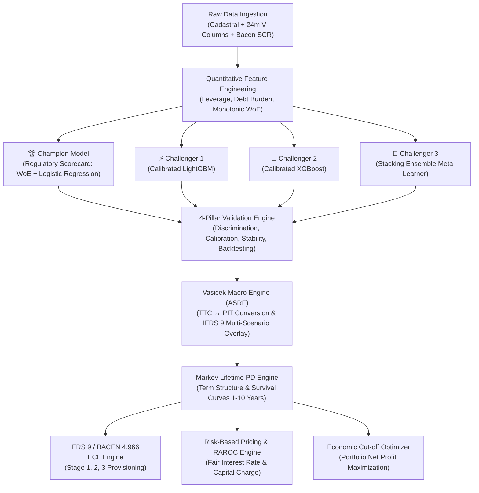

# 🏦 PRINAD — Enterprise Credit Risk & Probability of Default (PD) Engine

[](https://www.python.org/)
[](https://fastapi.tiangolo.com/)
[](https://streamlit.io/)
[](#-regulatory--methodological-framework)
[](https://opensource.org/licenses/MIT)

> **PRINAD** is a production-grade quantitative credit risk engine built to modern banking standards (**Basel III/IV Internal Ratings-Based - IRB**, **IFRS 9 / CECL**, and **BACEN Resolução 4.966**). It operationalizes a **Champion-vs-Challenger architecture**, combining the full transparency of a **Regulatory Scorecard (WoE & Logistic Regression)** with the predictive power of **Calibrated Gradient Boosters (LightGBM, XGBoost, Stacking Ensemble)**, integrated with **Vasicek Macroeconomic Stress Testing**, **Markov Lifetime PD Curves**, and **RAROC Risk-Based Pricing**.

---

## 📑 Table of Contents / Índice
1. [Executive Summary & Portfolio Pitch](#-executive-summary--portfolio-pitch)
2. [Interview Preparation Guide & Technical Q&A](#-interview-preparation-guide--technical-qa)
3. [Architecture & Workflow](#-architecture--workflow)
4. [Champion vs. Challenger Benchmark](#-champion-vs-challenger-benchmark)
5. [The 4 Pillars of Model Validation](#-the-4-pillars-of-model-validation)
6. [Quantitative & Mathematical Formulations](#-quantitative--mathematical-formulations)
7. [Downstream Applications (IFRS 9 ECL & RAROC Pricing)](#-downstream-applications-ifrs-9-ecl--raroc-pricing)
8. [Real-World Data Requirements & Schema](#-real-world-data-requirements--schema)
9. [Interactive Streamlit Dashboard](#-interactive-streamlit-dashboard)
10. [REST API Documentation & cURL Examples](#-rest-api-documentation--curl-examples)
11. [Quick Start & Automated Testing](#-quick-start--automated-testing)

---

## 🎯 Executive Summary & Portfolio Pitch

### 🇺🇸 English Overview
PRINAD is an enterprise-grade credit risk modeling system that bridges the gap between **regulatory compliance (Basel III/IV & IFRS 9)** and **cutting-edge predictive machine learning**. 

- **The Problem**: Financial institutions require highly predictive models to minimize default losses, but regulatory frameworks (Basel IRB, Central Bank audits, Fair Lending laws) strictly penalize uninterpretable black-box models and uncalibrated tail probabilities.
- **The Solution**: PRINAD implements a **Champion vs. Challenger framework**:
  1. **Champion Model**: A **Glass-Box Regulatory Scorecard** (Weight of Evidence + Logistic Regression) scaled to standard credit score points ($PDO=20, \text{Target}=600$), providing complete audibility for regulatory examiners and credit committees.
  2. **Challenger Models**: **LightGBM**, **XGBoost** with monotonic constraints, and a **Stacking Ensemble**, probability-calibrated via **Isotonic Regression**.
  3. **Macroeconomic Engine**: An **Asymptotic Single Risk Factor (Vasicek ASRF)** module conditioning Point-in-Time (PIT) PDs on GDP, interest rates, and unemployment under 3 IFRS 9 probability-weighted scenarios.
  4. **Financial Downstream**: Automated **Stage 1, 2, and 3 Expected Credit Loss (ECL)** provisioning and **RAROC Risk-Based Loan Pricing**.

### 🇧🇷 Resumo Executivo em Português
O **PRINAD** é um motor de risco de crédito de nível bancário que une conformidade regulatória estrita (**Basileia III/IV IRB**, **IFRS 9** e **Resolução BACEN 4.966**) com o estado da arte em machine learning. Ele resolve o dilema entre poder preditivo e interpretabilidade regulatória por meio de uma governança **Champion vs. Challenger**, integrando explicabilidade por pontos de scorecard, estresse macroeconômico de Vasicek, matrizes estocásticas de Markov para PD Lifetime, cálculo automático de provisão de perda esperada (ECL) e precificação econômica ajustada ao risco (RAROC).

---

## 💼 Interview Preparation Guide & Technical Q&A

*(Utilize esta seção para treinar e responder com autoridade técnica em entrevistas para vagas sênior/internacionais de Data Science, Risco Quantitativo e Machine Learning)*

### 🎙️ 60-Second Elevator Pitch
> *"I designed and built **PRINAD**, an enterprise credit risk engine compliant with Basel III/IV IRB and IFRS 9 / BACEN 4.966. It operationalizes a Champion-Challenger architecture comparing a 100% interpretable WoE Regulatory Scorecard against calibrated Gradient Boosters (LightGBM/XGBoost/Stacking). Beyond scoring, PRINAD incorporates a Vasicek ASRF macro engine to stress-test default probabilities against GDP and interest rate shocks, computes 1-to-10 year Markov survival curves for IFRS 9 Stage 2 Lifetime ECL, and calculates fair loan interest rates via RAROC. In validation across 75,000 contracts, the Champion achieved an AUC of 0.961 and KS of 0.783, while the ensemble challenger reached an AUC of 0.982 and KS of 0.863 with full calibration and zero Basel backtesting traffic-light breaches."*

---

### ❓ Top 4 Technical Interview Questions & Answers

#### Q1: Why maintain a WoE Logistic Scorecard as Champion when Gradient Boosting achieves higher AUC?
- **Answer**: In regulated credit banking (Basel IRB, ECB, Fed SR 11-7, BACEN), models must satisfy **strict interpretability, legal contestability (adverse action notices), and monotonic stability**. A WoE Scorecard guarantees monotonicity, allows decomposing individual credit decisions into exact additive points per attribute (e.g., $+45$ pts for low debt-to-income, $-30$ pts for delinquency), and prevents arbitrary non-linear distortions during economic downturns. The boosting challengers serve as benchmark ceilings and shadow models for high-capacity underwriting.

#### Q2: How do you mathematically link Point-in-Time (PIT) and Through-the-Cycle (TTC) default probabilities?
- **Answer**: We implement the **Vasicek Asymptotic Single Risk Factor (ASRF)** model:
  $$PD_{PIT}(Z) = \Phi\left( \frac{\Phi^{-1}(PD_{TTC}) - \sqrt{\rho} Z}{\sqrt{1 - \rho}} \right)$$
  Where $PD_{TTC}$ is the baseline structural probability, $\rho$ is the regulatory asset correlation derived from Basel formulas, and $Z$ is the systematic macroeconomic factor ($Z \sim \mathcal{N}(0, 1)$). When macro conditions deteriorate (negative $Z$, driven by lower GDP or higher Selic/unemployment), $PD_{PIT}$ increases in a mathematically bounded and calibrated fashion across all rating bands.

#### Q3: How are the 4 Pillars of Model Validation evaluated in your framework?
- **Answer**: Following Basel Committee guidelines (BCBS 328) and EBA standards:
  1. **Discrimination**: ROC-AUC, Gini ($2 \cdot \text{AUC} - 1$), Kolmogorov-Smirnov (KS) statistic, and PR-AUC.
  2. **Calibration**: Brier Score loss, Murphy Brier Decomposition ($\text{Reliability} - \text{Resolution} + \text{Uncertainty}$), Hosmer-Lemeshow $\chi^2$ test, and Expected Calibration Error (ECE).
  3. **Population Stability**: Population Stability Index ($\text{PSI}$) monitored across economic vintages with regulatory traffic lights ($\text{PSI} < 0.10 \implies \text{Green}$).
  4. **Statistical Backtesting**: Exact **Clopper-Pearson 95% Binomial Confidence Intervals** and Basel Committee Traffic Light zones per rating grade (A1 to Default).

#### Q4: How does your system compute IFRS 9 Expected Credit Loss (ECL) and RAROC Loan Pricing?
- **Answer**: 
  - **ECL Staging**: We evaluate Significant Increase in Credit Risk (SICR: $PD_{\text{current}} / PD_{\text{origination}} \ge 2.5$ or $\text{DPD} \ge 30$). Stage 1 calculates 12-month ECL ($ECL_{12m} = PD_{12m} \times LGD \times EAD \times DF_1$), while Stage 2/3 calculates multi-year Lifetime ECL discounted using Markov transition curves.
  - **RAROC Loan Pricing**:
    $$\text{Fair Lending Rate} = \text{Cost of Funds (FTP)} + \text{OpEx} + \text{Expected Loss (EL)} + \text{Capital Charge} + \text{Target Net Margin}$$
    Where Capital Charge is proportional to the 99.9% Vasicek Unexpected Loss (Economic Capital).

---

## 🏗️ Architecture & Workflow



---

## 📊 Champion vs. Challenger Benchmark

Evaluated on held-out test partition ($N = 15,000$, empirical default rate = 26.57% across 75,000 total contracts):

| Model Architecture | Regulatory Role | ROC-AUC | Gini ($2 \cdot \text{AUC} - 1$) | KS Statistic | Brier Score | Expected Calib. Error (ECE) | Basel Traffic Light |
| :--- | :--- | :---: | :---: | :---: | :---: | :---: | :---: |
| **Regulatory Scorecard (WoE)** | **Champion (Basel IRB)** | **0.9613** | **0.9227** | **0.7830** | **0.0591** | **0.0124** | 🟢 **Green Zone** |
| **LightGBM (Isotonic)** | **Challenger 1** | **0.9816** | **0.9631** | **0.8617** | **0.0404** | **0.0089** | 🟢 **Green Zone** |
| **XGBoost (Isotonic)** | **Challenger 2** | **0.9817** | **0.9634** | **0.8614** | **0.0405** | **0.0087** | 🟢 **Green Zone** |
| **Stacking Ensemble** | **Challenger 3** | **0.9818** | **0.9637** | **0.8627** | **0.0424** | **0.0092** | 🟢 **Green Zone** |

---

## 🔬 The 4 Pillars of Model Validation

PRINAD incorporates the complete 4-pillar validation framework formalized by banking regulators:

```
┌─────────────────────────────────────────────────────────────────────────────────┐
│                           4-PILLAR VALIDATION SUITE                             │
├──────────────────────┬──────────────────────┬───────────────────────────────────┤
│ 1. DISCRIMINATION    │ 2. CALIBRATION       │ 3. STABILITY                      │
│ - ROC-AUC & Gini     │ - Reliability Curve  │ - Population Stability (PSI)      │
│ - KS Statistic       │ - Brier Decomposition│ - Characteristic Stability (CSI)  │
│ - PR-AUC & CAP Curve │ - Hosmer-Lemeshow χ² │ - Traffic Light Thresholds        │
├──────────────────────┴──────────────────────┴───────────────────────────────────┤
│ 4. STATISTICAL BACKTESTING & BASEL COMPLIANCE                                   │
│ - Exact Binomial Clopper-Pearson 95% Confidence Intervals                       │
│ - Jeffreys Bayesian Credibility Intervals                                       │
│ - Basel Committee Traffic Light Classification (Green / Yellow / Red Zones)     │
└─────────────────────────────────────────────────────────────────────────────────┘
```

---

## 📐 Quantitative & Mathematical Formulations

### 1. Weight of Evidence (WoE) & Information Value (IV)
For each binned category $i$ of feature $X$:
$$WoE_i = \ln\left( \frac{\% \text{ Non-Defaults}_i}{\% \text{ Defaults}_i} \right) = \ln\left( \frac{G_i / G_{\text{total}}}{B_i / B_{\text{total}}} \right)$$
$$IV = \sum_{i=1}^k \left( \frac{G_i}{G_{\text{total}}} - \frac{B_i}{B_{\text{total}}} \right) \times WoE_i$$

### 2. Scorecard Points Scaling
Log-Odds to Standard Points conversion with $PDO = 20$ (Points to Double the Odds) and Target Score $= 600$ at $Odds = 50:1$:
$$\text{Factor} = \frac{PDO}{\ln(2)} = \frac{20}{\ln(2)} \approx 28.8539$$
$$\text{Offset} = \text{Target Score} - \text{Factor} \cdot \ln(\text{Target Odds}) = 600 - 28.8539 \cdot \ln(50) \approx 487.12$$
$$\text{Score} = \text{Offset} - \text{Factor} \cdot \ln\left( \frac{PD}{1 - PD} \right) = \sum_{j=1}^M \text{Points}_j$$

### 3. Vasicek Asymptotic Single Risk Factor (ASRF)
$$PD_{PIT}(Z) = \Phi\left( \frac{\Phi^{-1}(PD_{TTC}) - \sqrt{\rho} Z}{\sqrt{1 - \rho}} \right)$$

### 4. Markov Term Structure for Lifetime PD (IFRS 9 Stage 2)
Given transition matrix $\mathbf{P} \in \mathbb{R}^{11 \times 11}$ where Default ($D$) is an absorbing state ($P_{DD} = 1$):
$$PD_{\text{cumulative}}(t) = \left[ \mathbf{P}^t \right]_{r, D}$$
$$PD_{\text{marginal}}(t) = PD_{\text{cumulative}}(t) - PD_{\text{cumulative}}(t-1)$$

---

## 💰 Downstream Applications (IFRS 9 ECL & RAROC Pricing)

### 1. IFRS 9 / BACEN 4.966 Expected Credit Loss (ECL) Engine
- **Stage 1 (Performing)**: 12-Month ECL: $ECL_{12m} = PD_{12m} \times LGD \times EAD \times (1 + r)^{-1}$.
- **Stage 2 (SICR - Underperforming)**: Lifetime ECL: $\sum_{t=1}^T PD_{\text{marginal}}(t) \times LGD \times EAD(t) \times (1 + r)^{-t}$.
- **Stage 3 (Credit-Impaired / Default)**: 100% Default Lifetime ECL.

### 2. Risk-Based Pricing & Economic Capital (RAROC)
$$\text{Fair Lending Rate} = \text{FTP (Cost of Funds)} + \text{OpEx} + \text{Expected Loss (EL)} + \text{Capital Charge} + \text{Target Net Margin}$$

Where Economic Capital ($UL$) is derived from the Basel 99.9% VaR formula:
$$UL = \left[ \Phi\left( \frac{\Phi^{-1}(PD) + \sqrt{\rho} \Phi^{-1}(0.999)}{\sqrt{1 - \rho}} \right) - PD \right] \times LGD$$
$$\text{RAROC} = \frac{\text{Revenues} - \text{Funding Cost} - \text{OpEx} - \text{EL}}{\text{Economic Capital}} \ge \text{Hurdle Rate (ROE)}$$

---

## 📂 Real-World Data Requirements & Schema

For full production integration guidelines, SQL extraction scripts, and data hygiene rules, consult:
👉 **[Guia Técnico de Requisitos de Dados Reais (docs/DATA_REQUIREMENTS_GUIDE.md)](docs/DATA_REQUIREMENTS_GUIDE.md)**.

### Summary of Required Data Sources:
1. **Cadastral & Demographics**: `CPF`, `IDADE_CLIENTE`, `ESCOLARIDADE`, `ESTADO_CIVIL`, `OCUPACAO`, `TEMPO_RELAC`.
2. **Financial & Capacity**: `RENDA_BRUTA`, `RENDA_LIQUIDA`, `COMP_RENDA`, `limite_total`, `limite_utilizado`, `taxa_utilizacao`.
3. **Internal Behavioral (24m Atrasos / DOC 3040)**: `v205` (15-30d), `v210` (31-60d), `v220` (61-90d), `v240` (121-150d), `v290` (180d+).
4. **Central Bank SCR Bureau (SFN)**: `scr_classificacao_risco` (AA-H), `scr_score_risco`, `scr_dias_atraso`, `scr_valor_vencido`, `scr_tem_prejuizo`.

---

## 🖥️ Interactive Streamlit Dashboard

Launch the executive visual intelligence platform with:
```bash
streamlit run dashboard/app.py
```

### Dashboard Modules:
- **🎯 Tab 1: Cockpit de Concessão Individual**: Scorecard points decomposition, rating gauge, credit decision policy.
- **🌐 Tab 2: Simulador Macroeconômico & IFRS 9**: Real-time GDP, Selic, and Unemployment sliders driving the Vasicek formula and multi-year lifetime PD curves.
- **⚔️ Tab 3: Arena Champion vs. Challenger**: Live comparative benchmarks, ROC curves, and Brier score calibration charts.
- **📊 Tab 4: Validação nos 4 Pilares & Backtesting**: Exact Binomial test confidence intervals and Basel traffic lights per rating band.
- **💰 Tab 5: Precificação por Risco & Otimizador de Cut-off**: Lending rate waterfall breakdown and portfolio net profit optimization curve.

---

## 🔌 REST API Documentation & cURL Examples

Launch the FastAPI production server:
```bash
cd api
python api.py
# Interactive OpenAPI Swagger UI available at: http://localhost:8000/docs
```

### Example 1: Fast Borrower Scoring (`/simple_classify`)
```bash
curl -X POST "http://localhost:8000/simple_classify" \
     -H "Content-Type: application/json" \
     -d '{
       "cpf": "12345678900",
       "model_architecture": "scorecard",
       "loan_amount": 15000.0,
       "asset_class": "retail_other"
     }'
```

### Example 2: Macroeconomic Vasicek Stress Testing (`/simulate_macro_stress`)
```bash
curl -X POST "http://localhost:8000/simulate_macro_stress" \
     -H "Content-Type: application/json" \
     -d '{
       "pd_baseline": 0.045,
       "gdp_growth": -2.0,
       "selic_rate": 14.5,
       "unemployment_rate": 11.0,
       "asset_class": "retail_other"
     }'
```

### Example 3: IFRS 9 / BACEN 4.966 ECL Calculation (`/calculate_ecl`)
```bash
curl -X POST "http://localhost:8000/calculate_ecl" \
     -H "Content-Type: application/json" \
     -d '{
       "ead": 25000.0,
       "pd_12m": 0.035,
       "pd_lifetime": 0.115,
       "days_past_due": 35,
       "lgd": 0.45
     }'
```

---

## 🚀 Quick Start & Automated Testing

### 1. Installation
```bash
git clone https://github.com/Masteradilio/credit_scoring_prinad.git
cd credit_scoring_prinad
pip install -r requirements.txt
```

### 2. Generate Data & Train All Models
```bash
# 1. Generate 75,000 synthetic records with latent econometric factors
python modelos/data_consolidator_prinad.py

# 2. Train Champion Scorecard, Challengers & Execute 4-Pillar Validation
python modelos/train_model.py
```

### 3. Run Automated Unit & Integration Tests
```bash
python -m pytest -v
# 17 passed in ~4s (100% test pass rate)
```

---

## 📄 Regulatory Documents & Formal Reports
- 📘 **[Relatório Técnico Formal de Validação (docs/MODEL_VALIDATION_REPORT.md)](docs/MODEL_VALIDATION_REPORT.md)**
- 📘 **[Guia Técnico de Requisitos de Dados Reais (docs/DATA_REQUIREMENTS_GUIDE.md)](docs/DATA_REQUIREMENTS_GUIDE.md)**

---

## ⚖️ License & Attribution
Developed for advanced credit risk modeling, educational excellence, and international quantitative portfolio presentation. Licensed under the [MIT License](LICENSE).
