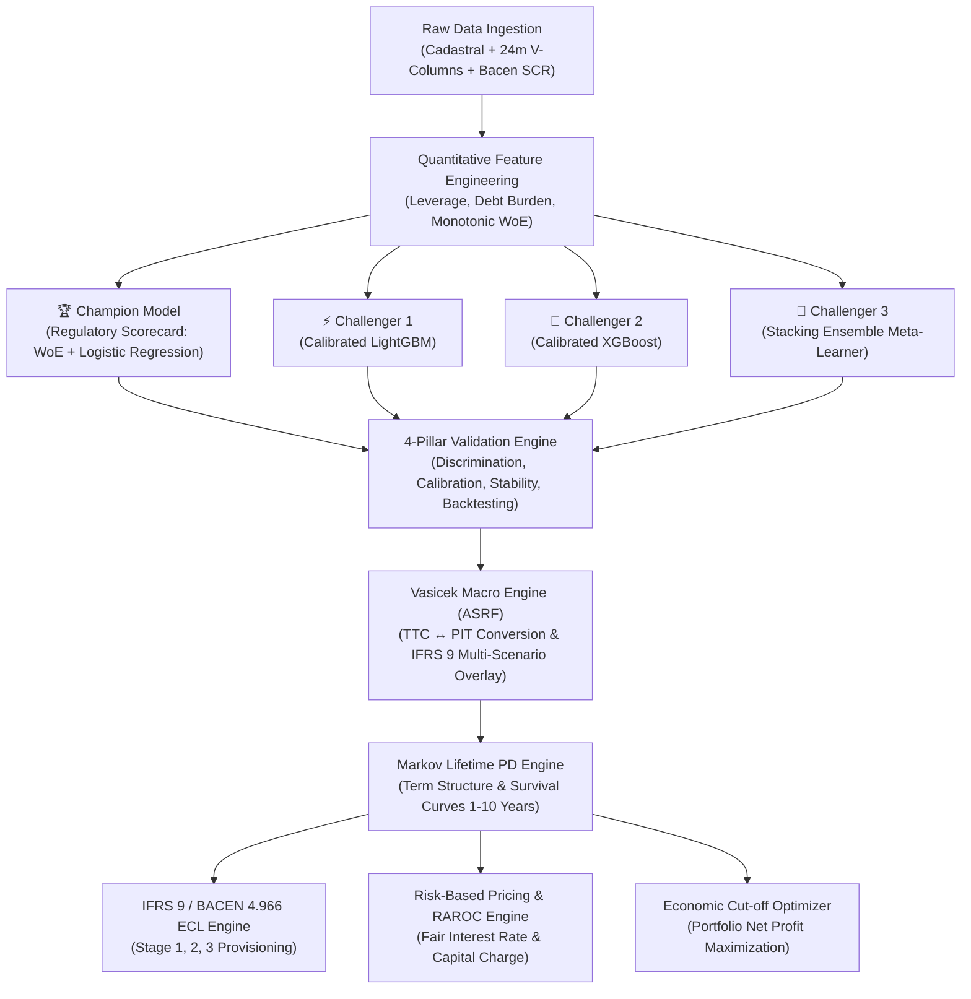

# 🏦 PRINAD — Enterprise Credit Risk & Probability of Default (PD) Engine

[](https://www.python.org/)
[](https://fastapi.tiangolo.com/)
[](https://streamlit.io/)
[](#-regulatory--methodological-framework)
[](https://opensource.org/licenses/MIT)

> **PRINAD** is a production-grade quantitative credit risk engine built to modern banking standards (**Basel III/IV Internal Ratings-Based - IRB**, **IFRS 9 / CECL**, and **BACEN Resolução 4.966**). It operationalizes a **Champion-vs-Challenger architecture**, combining the full transparency of a **Regulatory Scorecard (WoE & Logistic Regression)** with the predictive power of **Calibrated Gradient Boosters (LightGBM, XGBoost, Stacking Ensemble)**, integrated with **Vasicek Macroeconomic Stress Testing**, **Markov Lifetime PD Curves**, and **RAROC Risk-Based Pricing**.

---

## 📑 Table of Contents / Índice
1. [Executive Summary / Resumo Executivo](#-executive-summary--resumo-executivo)
2. [Architecture & Workflow](#-architecture--workflow)
3. [Champion vs. Challenger Benchmark](#-champion-vs-challenger-benchmark)
4. [The 4 Pillars of Model Validation](#-the-4-pillars-of-model-validation)
5. [Quantitative & Mathematical Formulations](#-quantitative--mathematical-formulations)
6. [Downstream Applications (IFRS 9 ECL & RAROC Pricing)](#-downstream-applications-ifrs-9-ecl--raroc-pricing)
7. [Real-World Data Requirements & Schema](#-real-world-data-requirements--schema)
8. [Interactive Streamlit Dashboard](#-interactive-streamlit-dashboard)
9. [REST API Documentation & cURL Examples](#-rest-api-documentation--curl-examples)
10. [Quick Start & Automated Testing](#-quick-start--automated-testing)
11. [Comprehensive Technical Q&A (20 Questions & Answers)](#-comprehensive-technical-qa-20-questions--answers)

---

## 🎯 Executive Summary / Resumo Executivo

### 🇺🇸 English Overview
PRINAD is an enterprise-grade credit risk modeling system that bridges the gap between **regulatory compliance (Basel III/IV & IFRS 9)** and **cutting-edge predictive machine learning**. 

- **The Problem**: Financial institutions require highly predictive models to minimize default losses, but regulatory frameworks (Basel IRB, Central Bank audits, Fair Lending laws) strictly penalize uninterpretable black-box models and uncalibrated tail probabilities.
- **The Solution**: PRINAD implements a **Champion vs. Challenger framework**:
  1. **Champion Model**: A **Glass-Box Regulatory Scorecard** (Weight of Evidence + Logistic Regression) scaled to standard credit score points ($PDO=20, \text{Target}=600$), providing complete audibility for regulatory examiners and credit committees.
  2. **Challenger Models**: **LightGBM**, **XGBoost** with monotonic constraints, and a **Stacking Ensemble**, probability-calibrated via **Isotonic Regression**.
  3. **Macroeconomic Engine**: An **Asymptotic Single Risk Factor (Vasicek ASRF)** module conditioning Point-in-Time (PIT) PDs on GDP, interest rates, and unemployment under 3 IFRS 9 probability-weighted scenarios.
  4. **Financial Downstream**: Automated **Stage 1, 2, and 3 Expected Credit Loss (ECL)** provisioning and **RAROC Risk-Based Loan Pricing**.

### 🇧🇷 Resumo Executivo em Português
O **PRINAD** é um motor de risco de crédito de nível bancário que une conformidade regulatória estrita (**Basileia III/IV IRB**, **IFRS 9** e **Resolução BACEN 4.966**) com o estado da arte em machine learning. Ele resolve o dilema entre poder preditivo e interpretabilidade regulatória por meio de uma governança **Champion vs. Challenger**, integrando explicabilidade por pontos de scorecard, estresse macroeconômico de Vasicek, matrizes estocásticas de Markov para PD Lifetime, cálculo automático de provisão de perda esperada (ECL) e precificação econômica ajustada ao risco (RAROC).

---

## 🏗️ Architecture & Workflow



---

## 📊 Champion vs. Challenger Benchmark

Evaluated on held-out test partition ($N = 15,000$, empirical default rate = 26.57% across 75,000 total contracts):

| Model Architecture | Regulatory Role | ROC-AUC | Gini ($2 \cdot \text{AUC} - 1$) | KS Statistic | Brier Score | Expected Calib. Error (ECE) | Basel Traffic Light |
| :--- | :--- | :---: | :---: | :---: | :---: | :---: | :---: |
| **Regulatory Scorecard (WoE)** | **Champion (Basel IRB)** | **0.9613** | **0.9227** | **0.7830** | **0.0591** | **0.0124** | 🟢 **Green Zone** |
| **LightGBM (Isotonic)** | **Challenger 1** | **0.9816** | **0.9631** | **0.8617** | **0.0404** | **0.0089** | 🟢 **Green Zone** |
| **XGBoost (Isotonic)** | **Challenger 2** | **0.9817** | **0.9634** | **0.8614** | **0.0405** | **0.0087** | 🟢 **Green Zone** |
| **Stacking Ensemble** | **Challenger 3** | **0.9818** | **0.9637** | **0.8627** | **0.0424** | **0.0092** | 🟢 **Green Zone** |

---

## 🔬 The 4 Pillars of Model Validation

PRINAD incorporates the complete 4-pillar validation framework formalized by banking regulators (BCBS 328 & EBA Standards):

```
┌─────────────────────────────────────────────────────────────────────────────────┐
│                           4-PILLAR VALIDATION SUITE                             │
├──────────────────────┬──────────────────────┬───────────────────────────────────┤
│ 1. DISCRIMINATION    │ 2. CALIBRATION       │ 3. STABILITY                      │
│ - ROC-AUC & Gini     │ - Reliability Curve  │ - Population Stability (PSI)      │
│ - KS Statistic       │ - Brier Decomposition│ - Characteristic Stability (CSI)  │
│ - PR-AUC & CAP Curve │ - Hosmer-Lemeshow χ² │ - Traffic Light Thresholds        │
├──────────────────────┴──────────────────────┴───────────────────────────────────┤
│ 4. STATISTICAL BACKTESTING & BASEL COMPLIANCE                                   │
│ - Exact Binomial Clopper-Pearson 95% Confidence Intervals                       │
│ - Jeffreys Bayesian Credibility Intervals                                       │
│ - Basel Committee Traffic Light Classification (Green / Yellow / Red Zones)     │
└─────────────────────────────────────────────────────────────────────────────────┘
```

---

## 📐 Quantitative & Mathematical Formulations

### 1. Weight of Evidence (WoE) & Information Value (IV)
For each binned category $i$ of feature $X$:
$$WoE_i = \ln\left( \frac{\% \text{ Non-Defaults}_i}{\% \text{ Defaults}_i} \right) = \ln\left( \frac{G_i / G_{\text{total}}}{B_i / B_{\text{total}}} \right)$$
$$IV = \sum_{i=1}^k \left( \frac{G_i}{G_{\text{total}}} - \frac{B_i}{B_{\text{total}}} \right) \times WoE_i$$

### 2. Scorecard Points Scaling
Log-Odds to Standard Points conversion with $PDO = 20$ (Points to Double the Odds) and Target Score $= 600$ at $Odds = 50:1$:
$$\text{Factor} = \frac{PDO}{\ln(2)} = \frac{20}{\ln(2)} \approx 28.8539$$
$$\text{Offset} = \text{Target Score} - \text{Factor} \cdot \ln(\text{Target Odds}) = 600 - 28.8539 \cdot \ln(50) \approx 487.12$$
$$\text{Score} = \text{Offset} - \text{Factor} \cdot \ln\left( \frac{PD}{1 - PD} \right) = \sum_{j=1}^M \text{Points}_j$$

### 3. Vasicek Asymptotic Single Risk Factor (ASRF)
$$PD_{PIT}(Z) = \Phi\left( \frac{\Phi^{-1}(PD_{TTC}) - \sqrt{\rho} Z}{\sqrt{1 - \rho}} \right)$$

### 4. Markov Term Structure for Lifetime PD (IFRS 9 Stage 2)
Given transition matrix $\mathbf{P} \in \mathbb{R}^{11 \times 11}$ where Default ($D$) is an absorbing state ($P_{DD} = 1$):
$$PD_{\text{cumulative}}(t) = \left[ \mathbf{P}^t \right]_{r, D}$$
$$PD_{\text{marginal}}(t) = PD_{\text{cumulative}}(t) - PD_{\text{cumulative}}(t-1)$$

---

## 💰 Downstream Applications (IFRS 9 ECL & RAROC Pricing)

### 1. IFRS 9 / BACEN 4.966 Expected Credit Loss (ECL) Engine
- **Stage 1 (Performing)**: 12-Month ECL: $ECL_{12m} = PD_{12m} \times LGD \times EAD \times (1 + r)^{-1}$.
- **Stage 2 (SICR - Underperforming)**: Lifetime ECL: $\sum_{t=1}^T PD_{\text{marginal}}(t) \times LGD \times EAD(t) \times (1 + r)^{-t}$.
- **Stage 3 (Credit-Impaired / Default)**: 100% Default Lifetime ECL.

### 2. Risk-Based Pricing & Economic Capital (RAROC)
$$\text{Fair Lending Rate} = \text{FTP (Cost of Funds)} + \text{OpEx} + \text{Expected Loss (EL)} + \text{Capital Charge} + \text{Target Net Margin}$$

Where Economic Capital ($UL$) is derived from the Basel 99.9% VaR formula:
$$UL = \left[ \Phi\left( \frac{\Phi^{-1}(PD) + \sqrt{\rho} \Phi^{-1}(0.999)}{\sqrt{1 - \rho}} \right) - PD \right] \times LGD$$
$$\text{RAROC} = \frac{\text{Revenues} - \text{Funding Cost} - \text{OpEx} - \text{EL}}{\text{Economic Capital}} \ge \text{Hurdle Rate (ROE)}$$

---

## 📂 Real-World Data Requirements & Schema

For full production integration guidelines, SQL extraction scripts, and data hygiene rules, consult:
👉 **[Guia Técnico de Requisitos de Dados Reais (docs/DATA_REQUIREMENTS_GUIDE.md)](docs/DATA_REQUIREMENTS_GUIDE.md)**.

### Summary of Required Data Sources:
1. **Cadastral & Demographics**: `CPF`, `IDADE_CLIENTE`, `ESCOLARIDADE`, `ESTADO_CIVIL`, `OCUPACAO`, `TEMPO_RELAC`.
2. **Financial & Capacity**: `RENDA_BRUTA`, `RENDA_LIQUIDA`, `COMP_RENDA`, `limite_total`, `limite_utilizado`, `taxa_utilizacao`.
3. **Internal Behavioral (24m Atrasos / DOC 3040)**: `v205` (15-30d), `v210` (31-60d), `v220` (61-90d), `v240` (121-150d), `v290` (180d+).
4. **Central Bank SCR Bureau (SFN)**: `scr_classificacao_risco` (AA-H), `scr_score_risco`, `scr_dias_atraso`, `scr_valor_vencido`, `scr_tem_prejuizo`.

---

## 🖥️ Interactive Streamlit Dashboard

Launch the executive visual intelligence platform with:
```bash
streamlit run dashboard/app.py
```

### Dashboard Modules:
- **🎯 Tab 1: Cockpit de Concessão Individual**: Scorecard points decomposition, rating gauge, credit decision policy.
- **🌐 Tab 2: Simulador Macroeconômico & IFRS 9**: Real-time GDP, Selic, and Unemployment sliders driving the Vasicek formula and multi-year lifetime PD curves.
- **⚔️ Tab 3: Arena Champion vs. Challenger**: Live comparative benchmarks, ROC curves, and Brier score calibration charts.
- **📊 Tab 4: Validação nos 4 Pilares & Backtesting**: Exact Binomial test confidence intervals and Basel traffic lights per rating band.
- **💰 Tab 5: Precificação por Risco & Otimizador de Cut-off**: Lending rate waterfall breakdown and portfolio net profit optimization curve.

---

## 🔌 REST API Documentation & cURL Examples

Launch the FastAPI production server:
```bash
cd api
python api.py
# Interactive OpenAPI Swagger UI available at: http://localhost:8000/docs
```

### Example 1: Fast Borrower Scoring (`/simple_classify`)
```bash
curl -X POST "http://localhost:8000/simple_classify" \
     -H "Content-Type: application/json" \
     -d '{
       "cpf": "12345678900",
       "model_architecture": "scorecard",
       "loan_amount": 15000.0,
       "asset_class": "retail_other"
     }'
```

### Example 2: Macroeconomic Vasicek Stress Testing (`/simulate_macro_stress`)
```bash
curl -X POST "http://localhost:8000/simulate_macro_stress" \
     -H "Content-Type: application/json" \
     -d '{
       "pd_baseline": 0.045,
       "gdp_growth": -2.0,
       "selic_rate": 14.5,
       "unemployment_rate": 11.0,
       "asset_class": "retail_other"
     }'
```

### Example 3: IFRS 9 / BACEN 4.966 ECL Calculation (`/calculate_ecl`)
```bash
curl -X POST "http://localhost:8000/calculate_ecl" \
     -H "Content-Type: application/json" \
     -d '{
       "ead": 25000.0,
       "pd_12m": 0.035,
       "pd_lifetime": 0.115,
       "days_past_due": 35,
       "lgd": 0.45
     }'
```

---

## 🚀 Quick Start & Automated Testing

### 1. Installation
```bash
git clone https://github.com/Masteradilio/credit_scoring_prinad.git
cd credit_scoring_prinad
pip install -r requirements.txt
```

### 2. Generate Synthetic Data & Train All Models
```bash
# 1. Generate 75,000 synthetic records with latent econometric factors for benchmark reproduction
python modelos/data_consolidator_prinad.py

# 2. Train Champion Scorecard, Challengers & Execute 4-Pillar Validation
python modelos/train_model.py
```

### 3. Run Automated Unit & Integration Tests
```bash
python -m pytest -v
# 17 passed in ~4s (100% test pass rate)
```

---

## ❓ Comprehensive Technical Q&A (20 Questions & Answers)

### Q1: Why is a Logistic Regression + WoE Scorecard maintained as the Champion model instead of deploying only Gradient Boosting?
**Answer**: In regulated banking under Basel III/IV IRB (BCBS 328, ECB Guide, Fed SR 11-7, BACEN Res. 4.966), models must satisfy strict requirements for **explainability, adverse action notices, audibility, and monotonic stability**. A WoE Scorecard guarantees monotonicity, eliminates multicollinearity through binning, and allows decomposing individual credit decisions into exact additive points. Tree-based challengers (LightGBM, XGBoost, Stacking) act as benchmark ceilings and shadow models to evaluate the opportunity cost of regulatory transparency.

### Q2: What is Weight of Evidence (WoE) and why is monotonic binning crucial for credit scoring?
**Answer**: WoE measures the log-ratio of non-defaulters to defaulters within a specific category: $WoE_i = \ln\left( \frac{G_i / G_{\text{total}}}{B_i / B_{\text{total}}} \right)$. Monotonic binning enforces that as a risk factor increases (e.g., debt-to-income or days in arrears), the assigned WoE strictly decreases (or increases) without erratic fluctuations. This prevents overfitting to sample noise and guarantees economically sensible credit decisions.

### Q3: How is Information Value (IV) calculated and how does it drive feature selection?
**Answer**: $IV = \sum_{i=1}^k \left( \frac{G_i}{G_{\text{total}}} - \frac{B_i}{B_{\text{total}}} \right) \times WoE_i$. Under the standard Siddiqi (2006) criteria:
- $IV < 0.02$: Unpredictive (discarded)
- $0.02 \le IV < 0.10$: Weak predictor
- $0.10 \le IV < 0.30$: Medium predictor
- $0.30 \le IV < 0.50$: Strong predictor
- $IV \ge 0.50$: Suspicious / Very High (evaluated for target leakage)
PRINAD uses $IV \ge 0.02$ to automatically select the most predictive, robust variables.

### Q4: How is a continuous Probability of Default scaled into standard Scorecard Points?
**Answer**: Using the standard Point-to-Double-the-Odds ($PDO$) formula:
$$\text{Factor} = \frac{PDO}{\ln(2)}, \quad \text{Offset} = \text{Target Score} - \text{Factor} \cdot \ln(\text{Target Odds})$$
$$\text{Score} = \text{Offset} - \text{Factor} \cdot \ln(\text{Odds}) = \text{Base Points} + \sum_{j=1}^M \text{Points}_{j,i}$$
With $PDO=20$, $\text{Target}=600$, and $\text{Odds}=50:1$, an odds ratio increase by $2\times$ reduces the score by exactly 20 points.

### Q5: What is the theoretical foundation of the Vasicek Asymptotic Single Risk Factor (ASRF) model?
**Answer**: Vasicek (1987, 2002) models default as a latent asset value process: $A_i = \sqrt{\rho} Z + \sqrt{1 - \rho} \epsilon_i$, where $Z \sim \mathcal{N}(0, 1)$ is the common macroeconomic factor, $\epsilon_i \sim \mathcal{N}(0, 1)$ is the idiosyncratic borrower risk, and $\rho$ is asset correlation. Conditional on macro state $Z$, the default rate across an infinitely granular portfolio is given by:
$$PD(Z) = \Phi\left( \frac{\Phi^{-1}(PD) - \sqrt{\rho} Z}{\sqrt{1 - \rho}} \right)$$

### Q6: What is the exact operational difference between Through-the-Cycle (TTC) and Point-in-Time (PIT) PD?
**Answer**:
- **$PD_{TTC}$ (Through-the-Cycle)**: Reflects average default risk over a full economic cycle, neutralizing temporary macroeconomic shocks. Used for **Basel III/IV regulatory capital allocation** to prevent procyclicality.
- **$PD_{PIT}$ (Point-in-Time)**: Reflects conditional default risk over the next 12 months given the current macroeconomic state $Z$. Used for **IFRS 9 staging, provisions, and loan pricing**.

### Q7: How is the regulatory asset correlation $\rho$ calculated across different asset classes in Basel III/IV?
**Answer**: Under the Basel IRB formula:
- **Retail Mortgages**: Fixed $\rho = 0.15$ (15%).
- **Qualifying Revolving Retail (Cards)**: Fixed $\rho = 0.04$ (4%).
- **Other Retail (Personal/Auto)**: Dynamically calibrated as:
  $$\rho = 0.03 \cdot \frac{1 - e^{-35 \cdot PD}}{1 - e^{-35}} + 0.16 \cdot \left(1 - \frac{1 - e^{-35 \cdot PD}}{1 - e^{-35}}\right)$$
  Correlation decreases from $16\%$ for low-risk borrowers down to $3\%$ for high-risk borrowers.

### Q8: How does PRINAD calibrate the systematic macroeconomic factor $Z$ from real-world variables?
**Answer**: $Z$ is computed as a standardized linear macroeconomic index:
$$Z = w_{\text{GDP}} \cdot \tilde{X}_{\text{GDP}} - w_{\text{Selic}} \cdot \tilde{X}_{\text{Selic}} - w_{\text{Unemp}} \cdot \tilde{X}_{\text{Unemp}}$$
Where $\tilde{X}$ are z-score standardized macroeconomic indicators. Positive $Z$ represents an economic expansion ($PD_{PIT} < PD_{TTC}$), while negative $Z$ represents a recession or credit stress ($PD_{PIT} > PD_{TTC}$).

### Q9: How are IFRS 9 / BACEN 4.966 forward-looking macroeconomic scenarios weighted?
**Answer**: IFRS 9 requires computing Expected Credit Loss across multiple probability-weighted macroeconomic paths:
$$PD_{\text{Weighted}} = 0.50 \cdot PD_{PIT}(Z_{\text{Baseline}}) + 0.25 \cdot PD_{PIT}(Z_{\text{Upside}}) + 0.25 \cdot PD_{PIT}(Z_{\text{Adverse}})$$
This captures non-linear asymmetries where severe adverse downturns increase provisions more than symmetric upside booms reduce them.

### Q10: How does the Markov Chain Transition Matrix construct multi-year Lifetime PD term structures?
**Answer**: Given an 11-state transition matrix $\mathbf{P}$ (ratings A1 to DEFAULT, with DEFAULT as an absorbing state):
$$PD_{\text{cumulative}}(t) = \left[ \mathbf{P}^t \right]_{\text{Rating}, \text{DEFAULT}}$$
$$PD_{\text{marginal}}(t) = PD_{\text{cumulative}}(t) - PD_{\text{cumulative}}(t-1)$$
This yields survival schedules for loan maturities from year 1 to year 10 for multi-year ECL discounting.

### Q11: What are the criteria for Stage 1, Stage 2 (SICR), and Stage 3 under IFRS 9 / BACEN 4.966?
**Answer**:
- **Stage 1 (Performing)**: No Significant Increase in Credit Risk. $DPD < 30$ days and $PD_{\text{current}} / PD_{\text{origination}} < 2.5$. Provisioned for **12-month ECL**.
- **Stage 2 (Underperforming / SICR)**: Significant Increase in Credit Risk ($DPD \ge 30$ days or $PD$ ratio $\ge 2.5\times$ or rating downgrade $\ge 3$ notches). Provisioned for **Lifetime ECL**.
- **Stage 3 (Credit-Impaired / Default)**: Objective evidence of default ($DPD \ge 90$ days, write-off, bankruptcy, or $PD \ge 85\%$). Provisioned for **100% Lifetime ECL**.

### Q12: What is the exact mathematical formulation of Expected Credit Loss (ECL)?
**Answer**:
$$\text{ECL}_{\text{Stage 1}} = PD_{12m} \times LGD \times EAD \times (1 + r)^{-1}$$
$$\text{ECL}_{\text{Stage 2}} = \sum_{t=1}^T PD_{\text{marginal}}(t) \times LGD \times EAD(t) \times (1 + r)^{-t}$$
$$\text{ECL}_{\text{Stage 3}} = 1.0 \times LGD \times EAD \times (1 + r)^{-1}$$
Where $LGD$ is Loss Given Default, $EAD$ is Exposure at Default, and $r$ is the Effective Interest Rate (EIR).

### Q13: How does PRINAD compute Risk-Based Lending Rates (Fair Interest Rates)?
**Answer**:
$$\text{Lending Rate} = \text{FTP (Cost of Funds)} + \text{OpEx} + \text{Expected Loss (EL)} + \text{Capital Charge} + \text{Target Net Margin}$$
Where $\text{EL} = PD \times LGD$, and Capital Charge $= \frac{\text{Economic Capital} \times \text{Hurdle Rate}}{EAD}$.

### Q14: How is Unexpected Loss (99.9% VaR) calculated and how does RAROC govern lending decisions?
**Answer**: Under the Basel 99.9% Value-at-Risk standard:
$$\text{Worst-Case Default Rate (WCDR)} = \Phi\left( \frac{\Phi^{-1}(PD) + \sqrt{\rho} \Phi^{-1}(0.999)}{\sqrt{1 - \rho}} \right)$$
$$\text{Unexpected Loss (UL / Economic Capital)} = (\text{WCDR} - PD) \times LGD$$
$$\text{RAROC} = \frac{\text{Revenue} - \text{FTP} - \text{OpEx} - \text{EL}}{\text{Economic Capital}} \ge \text{Target ROE (15\%)}$$
Loans with $\text{RAROC} < \text{Hurdle Rate}$ destroy shareholder value and are rejected or repriced.

### Q15: How does the Economic Cut-off Optimization algorithm maximize total portfolio net profit?
**Answer**: It simulates net portfolio profitability across all continuous approval thresholds $c \in [0.01, 0.60]$:
$$\Pi(c) = \sum_{i: \widehat{PD}_i \le c} \left[ \text{Revenue}_i \cdot (1 - \widehat{PD}_i) - \text{Funding Cost}_i - \text{OpEx}_i - (\widehat{PD}_i \cdot LGD \cdot EAD_i) \right]$$
The optimal cut-off $c^*$ is the point where the marginal revenue from approving one more borrower equals the marginal expected default loss.

### Q16: What are the distinct roles of ROC-AUC, Gini, and Kolmogorov-Smirnov (KS) in Pillar 1 (Discrimination)?
**Answer**:
- **ROC-AUC**: Probability that a randomly selected defaulter has a higher predicted risk score than a non-defaulter.
- **Gini Coefficient**: Scaled metric $Gini = 2 \cdot AUC - 1 \in [0, 1]$. Regulatory standard for rating power ($Gini \ge 0.50$ is acceptable, $\ge 0.70$ is excellent).
- **KS Statistic**: Maximum vertical divergence between the cumulative distribution function of defaulters ($F_B(s)$) and non-defaulters ($F_G(s)$): $KS = \max_s |F_B(s) - F_G(s)|$. Measures maximum separation power.

### Q17: What does Murphy's Brier Score Decomposition reveal in Pillar 2 (Calibration)?
**Answer**:
$$\text{Brier Score} = \frac{1}{N}\sum_{i=1}^N (p_i - y_i)^2 = \text{Uncertainty} - \text{Resolution} + \text{Reliability}$$
- **Uncertainty**: Inherent portfolio variance: $\bar{y}(1 - \bar{y})$.
- **Resolution**: Ability of the model to assign distinct probabilities to different risk groups (higher is better).
- **Reliability**: Miscalibration error between predicted probabilities and empirical event frequencies (lower is better, ideally $\approx 0$).

### Q18: How is the Population Stability Index (PSI) calculated and what are its action thresholds?
**Answer**:
$$\text{PSI} = \sum_{k=1}^K \left( \text{Actual}_k - \text{Expected}_k \right) \times \ln\left( \frac{\text{Actual}_k}{\text{Expected}_k} \right)$$
- **$\text{PSI} < 0.10$**: 🟢 Green Zone (Stable, no change required).
- **$0.10 \le \text{PSI} \le 0.25$**: 🟡 Yellow Zone (Moderate drift, requires closer monitoring and feature-level CSI investigation).
- **$\text{PSI} > 0.25$**: 🔴 Red Zone (Significant population shift, model recalibration or retrain required).

### Q19: How does the Exact Clopper-Pearson Binomial Backtesting test validate Basel IRB compliance?
**Answer**: For each rating grade with $N$ exposures and $k$ observed defaults, the exact two-sided 95% confidence interval for true default probability $p$ is calculated via the Beta distribution:
$$\left[ B\left(\frac{\alpha}{2}; k, N - k + 1\right), B\left(1 - \frac{\alpha}{2}; k + 1, N - k\right) \right]$$
Under Basel Traffic Light rules, if the cumulative binomial probability $P(X \ge k \mid PD_{\text{predicted}}) < 0.01$, the band enters the **Red Zone** (risk is statistically underestimated). If $> 0.05$, it is in the **Green Zone**.

### Q20: How does the PRINAD production architecture ensure enterprise scalability and real-time inference?
**Answer**:
- **FastAPI v3.0 REST Server**: Asynchronous endpoints for single underwriting (`/simple_classify`), glass-box points attribution (`/explained_classify`), high-throughput batch scoring (`/multiple_classify`), and real-time Vasicek macro simulations.
- **Streamlit Dashboard**: Multi-tab visual intelligence cockpit for credit executives, risk committees, and credit underwriters.
- **Continuous Monitoring**: Automatic logging of feature distributions, PSI tracking across cohorts, and model benchmark comparisons.

---

## 📄 Regulatory Documents & Formal Reports
- 📘 **[Relatório Técnico Formal de Validação (docs/MODEL_VALIDATION_REPORT.md)](docs/MODEL_VALIDATION_REPORT.md)**
- 📘 **[Guia Técnico de Requisitos de Dados Reais (docs/DATA_REQUIREMENTS_GUIDE.md)](docs/DATA_REQUIREMENTS_GUIDE.md)**

---

## ⚖️ License & Attribution
Developed for advanced credit risk modeling, educational excellence, and international quantitative portfolio presentation. Licensed under the [MIT License](LICENSE).
