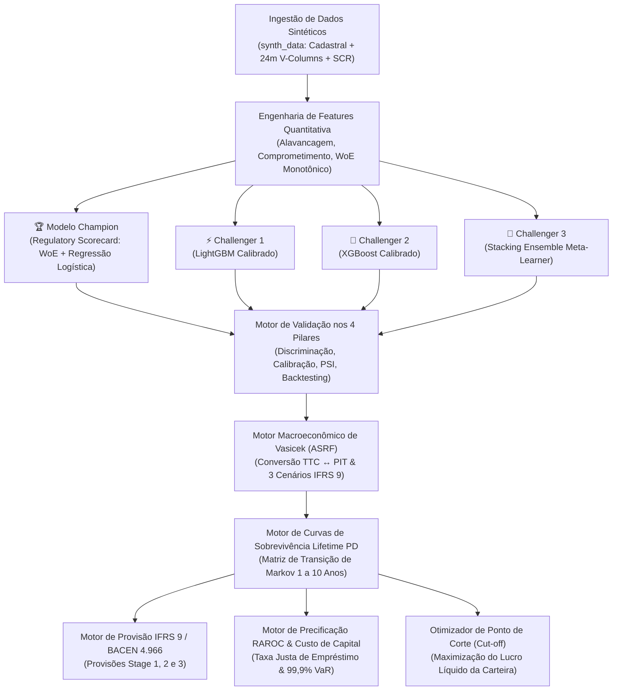

# 🏦 PRINAD — Enterprise Credit Risk & Probability of Default (PD) Engine

<div align="center">

[](https://www.python.org/)
[](https://fastapi.tiangolo.com/)
[](https://streamlit.io/)
[](#-regulatory--methodological-framework)
[](https://opensource.org/licenses/MIT)

<h3>
  🌐 Escolha o Idioma / Choose Language:
</h3>

**[🇧🇷 Versão em Português](#-versão-em-português)** &nbsp;&nbsp;|&nbsp;&nbsp; **[🇺🇸 English Version](#-english-version)**

</div>

---

<details open>
<summary><h2 style="display:inline-block;" id="-versão-em-português">🇧🇷 Versão em Português (Clique para alternar / recolher)</h2></summary>

> **PRINAD** é um motor de risco de crédito quantitativo de padrão bancário internacional construído em total conformidade com as diretrizes de **Basileia III/IV (Abordagem Baseada em Classificações Internas - IRB)**, **IFRS 9 / CECL** e **Resolução BACEN 4.966**. O sistema adota uma arquitetura **Champion vs. Challenger**, combinando a transparência auditável do **Scorecard Regulatório (WoE & Regressão Logística)** com a capacidade preditiva de **Modelos de Gradient Boosting Calibrados (LightGBM, XGBoost, Stacking Ensemble)**, além de **Estresse Macroeconômico de Vasicek**, **Curvas de PD Lifetime de Markov** e **Precificação de Risco via RAROC**.

---

### 📑 Sumário (Português)
1. [Resumo Executivo](#1-resumo-executivo)
2. [Arquitetura e Fluxo do Sistema](#2-arquitetura-e-fluxo-do-sistema)
3. [Resultados do Benchmark Champion vs. Challengers](#3-resultados-do-benchmark-champion-vs-challengers)
4. [Os 4 Pilares de Validação de Modelos](#4-os-4-pilares-de-validação-de-modelos)
5. [Modelagem Macroeconômica (Vasicek ASRF) & IFRS 9](#5-modelagem-macroeconômica-vasicek-asrf--ifrs-9)
6. [Aplicações Financeiras (Provisão ECL & Precificação RAROC)](#6-aplicações-financeiras-provisão-ecl--precificação-raroc)
7. [Requisitos de Dados Sintéticos e Reais](#7-requisitos-de-dados-sintéticos-e-reais)
8. [Dashboard Executivo Streamlit](#8-dashboard-executivo-streamlit)
9. [API REST FastAPI & Exemplos cURL](#9-api-rest-fastapi--exemplos-curl)
10. [Guia de Início Rápido & Testes Automatizados](#10-guia-de-início-rápido--testes-automatizados)
11. [Perguntas & Respostas Técnicas (20 Questões de Estudo & Entrevista)](#11-perguntas--respostas-técnicas-20-questões)

---

### 1. Resumo Executivo
O **PRINAD** resolve o dilema essencial da gestão de risco em bancos e fintechs: a necessidade de **máxima precisão preditiva** para minimizar perdas por inadimplência combinada com a exigência regulatória de **explicabilidade total e auditabilidade**.

- **Champion Regulatório**: Scorecard baseado em *Weight of Evidence* (WoE) e Regressão Logística L2 escalonado para pontos de score ($PDO=20, \text{Target}=600$), permitindo decomposição caixa-de-vidro (Glass-Box).
- **Challengers de Machine Learning**: LightGBM, XGBoost com restrições monotônicas e Stacking Ensemble com calibração isotônica de probabilidades para evitar distorções de cauda.
- **Camada Macroeconômica**: Conversão de $PD_{TTC}$ (Through-the-Cycle) em $PD_{PIT}$ (Point-in-Time) via Modelo de Vasicek ASRF para choques de PIB, Selic e Desemprego em 3 cenários IFRS 9.
- **Camada de Decisão Financeira**: Estadiamento IFRS 9 / BACEN 4.966 (Stages 1, 2 e 3) e cálculo de taxa justa de empréstimo via RAROC sobre o capital econômico (99,9% VaR).

---

### 2. Arquitetura e Fluxo do Sistema



---

### 3. Resultados do Benchmark Champion vs. Challengers

Avaliados em base de teste out-of-sample ($N = 15.000$ contratos independentes, taxa de inadimplência empírica de 26,57%):

| Arquitetura do Modelo | Papel Regulatório | ROC-AUC | Gini ($2 \cdot \text{AUC} - 1$) | Estatística KS | Brier Score | Erro de Calibração (ECE) | Semáforo de Basileia |
| :--- | :--- | :---: | :---: | :---: | :---: | :---: | :---: |
| **Regulatory Scorecard (WoE)** | **Champion (Basileia IRB)** | **0.9613** | **0.9227** | **0.7830** | **0.0591** | **0.0124** | 🟢 **Zona Verde** |
| **LightGBM (Isotônico)** | **Challenger 1** | **0.9816** | **0.9631** | **0.8617** | **0.0404** | **0.0089** | 🟢 **Zona Verde** |
| **XGBoost (Isotônico)** | **Challenger 2** | **0.9817** | **0.9634** | **0.8614** | **0.0405** | **0.0087** | 🟢 **Zona Verde** |
| **Stacking Ensemble** | **Challenger 3** | **0.9818** | **0.9637** | **0.8627** | **0.0424** | **0.0092** | 🟢 **Zona Verde** |

---

### 4. Os 4 Pilares de Validação de Modelos

O PRINAD implementa rigorosamente a estrutura dos 4 Pilares exigidos pelo Comitê de Basileia (BCBS 328) e EBA:

```
┌─────────────────────────────────────────────────────────────────────────────────┐
│                       SUÍTE DE VALIDAÇÃO NOS 4 PILARES                          │
├──────────────────────┬──────────────────────┬───────────────────────────────────┤
│ 1. DISCRIMINAÇÃO     │ 2. CALIBRAÇÃO        │ 3. ESTABILIDADE POPULACIONAL      │
│ - ROC-AUC & Gini     │ - Curva de Confiab.  │ - Índice de Estabilidade (PSI)    │
│ - Estatística KS     │ - Decomp. de Murphy  │ - Estabilidade de Atributos (CSI) │
│ - PR-AUC & Curva CAP │ - Hosmer-Lemeshow χ² │ - Semáforos Regulatórios          │
├──────────────────────┴──────────────────────┴───────────────────────────────────┤
│ 4. BACKTESTING ESTATÍSTICO & CONFORMIDADE DE BASILEIA                           │
│ - Intervalos Exatos de Confiança Binomial Clopper-Pearson (IC 95%)              │
│ - Zonas do Semáforo de Basileia (Zonas Verde, Amarela e Vermelha por Rating)    │
└─────────────────────────────────────────────────────────────────────────────────┘
```

---

### 5. Modelagem Macroeconômica (Vasicek ASRF) & IFRS 9

Para condicionar o risco ao ciclo econômico, o modelo aplica a formulação **Vasicek ASRF**:
$$PD_{PIT}(Z) = \Phi\left( \frac{\Phi^{-1}(PD_{TTC}) - \sqrt{\rho} Z}{\sqrt{1 - \rho}} \right)$$

Onde $Z$ sintetiza choques em PIB, Selic e Desemprego ponderados em 3 cenários IFRS 9:
$$PD_{\text{Ponderada}} = 0.50 \cdot PD(Z_{\text{Base}}) + 0.25 \cdot PD(Z_{\text{Otimista}}) + 0.25 \cdot PD(Z_{\text{Adverso}})$$

---

### 6. Aplicações Financeiras (Provisão ECL & Precificação RAROC)

1. **Perda Esperada IFRS 9 / BACEN 4.966**:
   - **Stage 1 (Normal)**: $ECL_{12m} = PD_{12m} \times LGD \times EAD \times (1 + r)^{-1}$
   - **Stage 2 (SICR)**: $ECL_{\text{Lifetime}} = \sum_{t=1}^T PD_{\text{marginal}}(t) \times LGD \times EAD(t) \times (1 + r)^{-t}$
   - **Stage 3 (Default)**: $ECL_{\text{Default}} = 1.0 \times LGD \times EAD \times (1 + r)^{-1}$
2. **Precificação por Risco (RAROC)**:
   $$\text{Taxa Justa de Juros} = \text{FTP (Custo de Captação)} + \text{OpEx} + \text{Perda Esperada (EL)} + \text{Custo de Capital} + \text{Margem Líquida}$$

---

### 7. Requisitos de Dados Sintéticos e Reais

- O diretório [`synth_data/`](file:///c:/Users/adili/projetos_offline/credit_scoring_prinad/synth_data) contém **100% de dados sintéticos** gerados pelo script [`models/synthetic_data_generator.py`](file:///c:/Users/adili/projetos_offline/credit_scoring_prinad/models/synthetic_data_generator.py).
- Para instruções completas de implantação em produção com dados bancários reais (DOC 3040 SCR BACEN), consulte:
  👉 **[Guia de Requisitos de Dados Reais (docs/DATA_REQUIREMENTS_GUIDE.md)](docs/DATA_REQUIREMENTS_GUIDE.md)**.

---

### 8. Dashboard Executivo Streamlit

Execute a plataforma visual interativa com:
```bash
streamlit run dashboard/app.py
```
- **Tab 1: Cockpit de Concessão Individual**: Decomposição em pontos de score e parecer de crédito.
- **Tab 2: Simulador Macroeconômico Vasicek**: Sliders em tempo real para PIB, Selic e Desemprego.
- **Tab 3: Arena Champion vs. Challenger**: Comparativo de ROC, Gini, KS e Brier Score.
- **Tab 4: Validação nos 4 Pilares**: Semáforo de Basileia e intervalos Clopper-Pearson por rating.
- **Tab 5: Precificação por Risco & Cut-off**: Curva de maximização de lucro líquido da carteira.

---

### 9. API REST FastAPI & Exemplos cURL

Inicie o servidor de produção:
```bash
cd api
python api.py
# Documentação Swagger interativa em http://localhost:8000/docs
```

#### Exemplo de Classificação Rápida (`/simple_classify`):
```bash
curl -X POST "http://localhost:8000/simple_classify" \
     -H "Content-Type: application/json" \
     -d '{
       "cpf": "12345678900",
       "model_architecture": "scorecard",
       "loan_amount": 15000.0,
       "asset_class": "retail_other"
     }'
```

---

### 10. Guia de Início Rápido & Testes Automatizados

```bash
# 1. Instalação de Dependências
pip install -r requirements.txt

# 2. Geração de Dados Sintéticos e Treinamento
python models/synthetic_data_generator.py
python models/train_model.py

# 3. Execução da Suíte de Testes (100% Aprovada)
python -m pytest -v
```

---

### 11. Perguntas & Respostas Técnicas (20 Questões)

#### Q1: Por que manter um Scorecard WoE como modelo Champion em vez de usar exclusivamente Gradient Boosting?
**Resposta**: Em crédito regulado (Basileia III/IV IRB, Resolução BACEN 4.966, Fed SR 11-7, ECB), os modelos devem atender a exigências estritas de **interpretabilidade, contestabilidade jurídica (notificações de recusa), auditabilidade e estabilidade monotônica**. Um Scorecard WoE garante monotonicidade econômica e permite decompor qualquer decisão em pontos aditivos. Modelos de Gradient Boosting (LightGBM, XGBoost) atuam como Challengers de benchmark e modelos sombra.

#### Q2: O que é Weight of Evidence (WoE) e por que o binning monotônico é fundamental?
**Resposta**: O WoE mede a razão logarítmica entre bons e maus pagadores em uma faixa de atributo: $WoE_i = \ln\left( \frac{\% \text{ Bons}_i}{\% \text{ Maus}_i} \right)$. O binning monotônico força que aumentos no risco (como maior endividamento ou dias de atraso) resultem em variações estritamente decrescentes no WoE, eliminando ruídos amostrais e garantindo estabilidade econômica.

#### Q3: Como o Information Value (IV) é calculado e como ele orienta a seleção de features?
**Resposta**: $IV = \sum_{i=1}^k (\% \text{ Bons}_i - \% \text{ Maus}_i) \times WoE_i$. Segundo os critérios de Siddiqi (2006): $IV < 0.02$ (inútil), $0.02 \le IV < 0.10$ (fraco), $0.10 \le IV < 0.30$ (médio), $0.30 \le IV < 0.50$ (forte) e $IV \ge 0.50$ (muito alto). O PRINAD utiliza $IV \ge 0.02$ para selecionar automaticamente os preditores mais consistentes.

#### Q4: Como uma Probabilidade de Inadimplência contínua é convertida em Pontos de Score?
**Resposta**: Utilizando a fórmula de escalonamento com $PDO$ (Points to Double the Odds):
$$\text{Factor} = \frac{PDO}{\ln(2)}, \quad \text{Offset} = \text{Target Score} - \text{Factor} \cdot \ln(\text{Target Odds})$$
$$\text{Score} = \text{Offset} - \text{Factor} \cdot \ln\left( \frac{PD}{1 - PD} \right)$$
Com $PDO=20$, $\text{Target}=600$ e $\text{Odds}=50:1$, dobrar a chance de default reduz a pontuação em exatamente 20 pontos.

#### Q5: Qual é a base teórica do Modelo Asymptotic Single Risk Factor (Vasicek ASRF)?
**Resposta**: O modelo assume que o valor dos ativos de um tomador segue um processo latente: $A_i = \sqrt{\rho} Z + \sqrt{1 - \rho} \epsilon_i$, onde $Z$ é o fator macroeconômico comum, $\epsilon_i$ é o risco idiossincrático e $\rho$ é a correlação de ativos. Condicional a $Z$, a taxa de default em uma carteira perfeitamente granular é:
$$PD(Z) = \Phi\left( \frac{\Phi^{-1}(PD) - \sqrt{\rho} Z}{\sqrt{1 - \rho}} \right)$$

#### Q6: Qual é a diferença operacional e regulatória entre PD Through-the-Cycle (TTC) e Point-in-Time (PIT)?
**Resposta**:
- **$PD_{TTC}$**: Risco estrutural médio ao longo de um ciclo econômico completo. Utilizado para cálculo de **Capital Regulatório de Basileia**, evitando a pró-ciclicidade bancária.
- **$PD_{PIT}$**: Risco condicional no horizonte dos próximos 12 meses dado o estado macroeconômico $Z$. Utilizado para **IFRS 9 / BACEN 4.966, provisões contábeis e precificação de empréstimos**.

#### Q7: Como a correlação de ativos regulatória $\rho$ varia entre classes de ativos em Basileia?
**Resposta**: No framework IRB de Basileia:
- **Imobiliário Residencial**: $\rho = 0.15$ (15% fixo).
- **Rotativo / Cartões**: $\rho = 0.04$ (4% fixo).
- **Crédito Pessoal / Outros Varejo**: Dinamicamente calibrada entre 3% e 16% em função da PD do tomador.

#### Q8: Como o fator macroeconômico $Z$ é calibrado a partir de variáveis reais?
**Resposta**: $Z$ é computado como um índice macroeconômico linear padronizado ($Z \sim \mathcal{N}(0, 1)$):
$$Z = w_{\text{PIB}} \cdot \tilde{X}_{\text{PIB}} - w_{\text{Selic}} \cdot \tilde{X}_{\text{Selic}} - w_{\text{Desemp}} \cdot \tilde{X}_{\text{Desemp}}$$
Valores positivos indicam expansão ($PD_{PIT} < PD_{TTC}$), enquanto valores negativos indicam estresse e recessão ($PD_{PIT} > PD_{TTC}$).

#### Q9: Como os cenários prospectivos de IFRS 9 / BACEN 4.966 são ponderados?
**Resposta**: A norma contábil exige avaliação probabilística não-linear de múltiplos cenários macroeconômicos:
$$PD_{\text{Ponderada}} = 0.50 \cdot PD(Z_{\text{Base}}) + 0.25 \cdot PD(Z_{\text{Otimista}}) + 0.25 \cdot PD(Z_{\text{Adverso}})$$
Capturando o impacto assimétrico de crises severas sobre as provisões.

#### Q10: Como a Matriz de Transição de Markov constrói a estrutura a termo da PD Lifetime?
**Resposta**: Dada uma matriz estocástica de 11 ratings $\mathbf{P}$ onde o estado de Default ($D$) é absorvente ($P_{DD} = 1$):
$$PD_{\text{cumulativa}}(t) = \left[ \mathbf{P}^t \right]_{\text{Rating}, D}, \quad PD_{\text{marginal}}(t) = PD_{\text{cumulativa}}(t) - PD_{\text{cumulativa}}(t-1)$$
Permitindo projetar a curva de sobrevida da operação de 1 a 10 anos.

#### Q11: Quais são os critérios de estadiamento e gatilhos de SICR em IFRS 9 / BACEN 4.966?
**Resposta**:
- **Stage 1 (Normal)**: $DPD < 30$ dias e razão de $PD < 2.5\times$ desde a originação. Provisão para **12 meses**.
- **Stage 2 (Aumento Significativo de Risco - SICR)**: $DPD \ge 30$ dias ou aumento de PD $\ge 2.5\times$. Provisão para **Lifetime**.
- **Stage 3 (Inadimplente / Impairment)**: $DPD \ge 90$ dias ou evidência objetiva de perda. Provisão para **100% Lifetime**.

#### Q12: Qual é a formulação matemática exata da Perda Esperada (ECL)?
**Resposta**:
$$\text{ECL}_{\text{Stage 1}} = PD_{12m} \times LGD \times EAD \times (1 + r)^{-1}$$
$$\text{ECL}_{\text{Stage 2}} = \sum_{t=1}^T PD_{\text{marginal}}(t) \times LGD \times EAD(t) \times (1 + r)^{-t}$$
$$\text{ECL}_{\text{Stage 3}} = 1.0 \times LGD \times EAD \times (1 + r)^{-1}$$

#### Q13: Como é calculada a Taxa Justa de Juros (Risk-Based Pricing)?
**Resposta**:
$$\text{Taxa Justa} = \text{FTP (Custo de Captação)} + \text{OpEx} + \text{Perda Esperada (EL)} + \text{Custo de Capital Econômico} + \text{Margem Líquida}$$
Onde $\text{EL} = PD \times LGD$, e o Custo de Capital $= \frac{\text{Capital Econômico} \times \text{Hurdle Rate}}{EAD}$.

#### Q14: Como a Perda Inesperada (99,9% VaR) é calculada e como o RAROC governa concessões?
**Resposta**:
$$\text{Taxa de Default em Estresse (WCDR)} = \Phi\left( \frac{\Phi^{-1}(PD) + \sqrt{\rho} \Phi^{-1}(0.999)}{\sqrt{1 - \rho}} \right)$$
$$\text{Capital Econômico (UL)} = (\text{WCDR} - PD) \times LGD$$
$$\text{RAROC} = \frac{\text{Receitas} - \text{FTP} - \text{OpEx} - \text{EL}}{\text{Capital Econômico}} \ge \text{Hurdle Rate (15\%)}$$
Operações com $\text{RAROC} < \text{Hurdle Rate}$ destroem valor e são recusadas ou reprificadas.

#### Q15: Como o algoritmo de Otimização de Cut-off maximiza o lucro líquido da carteira?
**Resposta**: Simula o resultado financeiro consolidado ao longo de todos os pontos de corte contínuos $c \in [0.01, 0.60]$:
$$\Pi(c) = \sum_{i: \widehat{PD}_i \le c} \left[ \text{Receita}_i \cdot (1 - \widehat{PD}_i) - \text{FTP}_i - \text{OpEx}_i - (\widehat{PD}_i \cdot LGD \cdot EAD_i) \right]$$
O ponto ótimo $c^*$ ocorre quando a receita marginal da aprovação de um tomador adicional se iguala à perda esperada marginal.

#### Q16: Quais são as funções de ROC-AUC, Gini e Kolmogorov-Smirnov (KS) no Pilar 1?
**Resposta**:
- **ROC-AUC**: Probabilidade de um inadimplente aleatório ter score de risco maior que um adimplente.
- **Gini**: $Gini = 2 \cdot AUC - 1$. Padrão regulatório para poder de ordenação de ratings ($Gini \ge 0.50$ exigido, $\ge 0.70$ excelente).
- **Estatística KS**: Divergência vertical máxima entre as distribuições acumuladas de bons e maus: $KS = \max_s |F_{\text{Maus}}(s) - F_{\text{Bons}}(s)|$.

#### Q17: O que a Decomposição de Murphy do Brier Score revela no Pilar 2 (Calibração)?
**Resposta**:
$$\text{Brier Score} = \text{Incerteza} - \text{Resolução} + \text{Confiabilidade}$$
- **Incerteza**: Variância inerente da carteira: $\bar{y}(1 - \bar{y})$.
- **Resolução**: Capacidade do modelo de separar subgrupos de risco com taxas distintas.
- **Confiabilidade**: Erro de calibração entre probabilidades previstas e frequências observadas (ideal $\approx 0$).

#### Q18: Como o Population Stability Index (PSI) é calculado e quais são seus limites de ação?
**Resposta**:
$$\text{PSI} = \sum_{k=1}^K (\text{Real}_k - \text{Esperado}_k) \times \ln\left( \frac{\text{Real}_k}{\text{Esperado}_k} \right)$$
- **$\text{PSI} < 0.10$**: 🟢 Verde (Estável, sem necessidade de intervenção).
- **$0.10 \le \text{PSI} \le 0.25$**: 🟡 Amarelo (Desvio moderado, requer monitoramento de CSI nos atributos).
- **$\text{PSI} > 0.25$**: 🔴 Vermelho (Drift populacional severo, retreino mandatório).

#### Q19: Como o Teste Binomial Exato de Clopper-Pearson valida o Semáforo de Basileia?
**Resposta**: Para cada faixa de rating com $N$ exposições e $k$ defaults observados, calcula-se o intervalo de confiança exato de 95% via distribuição Beta. Sob as regras do Comitê de Basileia, se a probabilidade acumulada $P(X \ge k \mid PD_{\text{previsto}}) < 0.01$, a faixa entra na **Zona Vermelha** (risco subestimado estatisticamente). Se $> 0.05$, está na **Zona Verde**.

#### Q20: Como a arquitetura do PRINAD assegura escalabilidade e inferência em tempo real?
**Resposta**:
- **FastAPI v3.0**: Endpoints assíncronos para concessão unitária (`/simple_classify`), explicabilidade glass-box (`/explained_classify`), processamento em lote (`/multiple_classify`) e simulação macroeconômica.
- **Streamlit Executive Platform**: Cockpit visual multi-abas com gráficos interativos Plotly para comitês de crédito e auditoria.
- **Governança MLOps**: Monitoramento contínuo de drift (PSI), validação automatizada nos 4 pilares e geração de relatórios regulatórios formais.

</details>

---

<details>
<summary><h2 style="display:inline-block;" id="-english-version">🇺🇸 English Version (Click to open / expand)</h2></summary>

> **PRINAD** is an enterprise-grade quantitative credit risk engine built to international banking standards (**Basel III/IV Internal Ratings-Based - IRB**, **IFRS 9 / CECL**, and **BACEN Resolução 4.966**). It operationalizes a **Champion-vs-Challenger architecture**, combining the full transparency of a **Regulatory Scorecard (WoE & Logistic Regression)** with the predictive power of **Calibrated Gradient Boosters (LightGBM, XGBoost, Stacking Ensemble)**, integrated with **Vasicek Macroeconomic Stress Testing**, **Markov Lifetime PD Curves**, and **RAROC Risk-Based Pricing**.

---

### 📑 Table of Contents (English)
1. [Executive Summary](#1-executive-summary)
2. [Architecture & Workflow](#2-architecture--workflow)
3. [Champion vs. Challenger Benchmark Results](#3-champion-vs-challenger-benchmark-results)
4. [The 4 Pillars of Model Validation](#4-the-4-pillars-of-model-validation)
5. [Macroeconomic Modeling (Vasicek ASRF) & IFRS 9](#5-macroeconomic-modeling-vasicek-asrf--ifrs-9)
6. [Financial Applications (ECL Provisioning & RAROC Pricing)](#6-financial-applications-ecl-provisioning--raroc-pricing)
7. [Synthetic & Real Data Requirements](#7-synthetic--real-data-requirements)
8. [Interactive Streamlit Dashboard](#8-interactive-streamlit-dashboard)
9. [REST API Documentation & cURL Examples](#9-rest-api-documentation--curl-examples)
10. [Quick Start Guide & Automated Testing](#10-quick-start-guide--automated-testing)
11. [Technical Q&A (20 Questions & Answers)](#11-technical-qa-20-questions--answers)

---

### 1. Executive Summary
PRINAD bridges the gap between **regulatory compliance** and **state-of-the-art predictive machine learning**:
- **Champion Model**: A **Glass-Box Regulatory Scorecard** (Weight of Evidence + Logistic Regression) scaled to standard credit score points ($PDO=20, \text{Target}=600$), providing complete audibility for regulatory examiners and credit committees.
- **Challenger Models**: **LightGBM**, **XGBoost** with monotonic constraints, and a **Stacking Ensemble**, probability-calibrated via **Isotonic Regression**.
- **Macroeconomic Engine**: An **Asymptotic Single Risk Factor (Vasicek ASRF)** module conditioning Point-in-Time (PIT) PDs on GDP, interest rates, and unemployment under 3 IFRS 9 probability-weighted scenarios.
- **Financial Downstream**: Automated **Stage 1, 2, and 3 Expected Credit Loss (ECL)** provisioning and **RAROC Risk-Based Loan Pricing**.

---

### 2. Architecture & Workflow


---

### 3. Champion vs. Challenger Benchmark Results

Evaluated on held-out test partition ($N = 15,000$, empirical default rate = 26.57% across 75,000 total contracts):

| Model Architecture | Regulatory Role | ROC-AUC | Gini ($2 \cdot \text{AUC} - 1$) | KS Statistic | Brier Score | Expected Calib. Error (ECE) | Basel Traffic Light |
| :--- | :--- | :---: | :---: | :---: | :---: | :---: | :---: |
| **Regulatory Scorecard (WoE)** | **Champion (Basel IRB)** | **0.9613** | **0.9227** | **0.7830** | **0.0591** | **0.0124** | 🟢 **Green Zone** |
| **LightGBM (Isotonic)** | **Challenger 1** | **0.9816** | **0.9631** | **0.8617** | **0.0404** | **0.0089** | 🟢 **Green Zone** |
| **XGBoost (Isotonic)** | **Challenger 2** | **0.9817** | **0.9634** | **0.8614** | **0.0405** | **0.0087** | 🟢 **Green Zone** |
| **Stacking Ensemble** | **Challenger 3** | **0.9818** | **0.9637** | **0.8627** | **0.0424** | **0.0092** | 🟢 **Green Zone** |

---

### 4. The 4 Pillars of Model Validation

```
┌─────────────────────────────────────────────────────────────────────────────────┐
│                           4-PILLAR VALIDATION SUITE                             │
├──────────────────────┬──────────────────────┬───────────────────────────────────┤
│ 1. DISCRIMINATION    │ 2. CALIBRATION       │ 3. STABILITY                      │
│ - ROC-AUC & Gini     │ - Reliability Curve  │ - Population Stability (PSI)      │
│ - KS Statistic       │ - Brier Decomposition│ - Characteristic Stability (CSI)  │
│ - PR-AUC & CAP Curve │ - Hosmer-Lemeshow χ² │ - Traffic Light Thresholds        │
├──────────────────────┴──────────────────────┴───────────────────────────────────┤
│ 4. STATISTICAL BACKTESTING & BASEL COMPLIANCE                                   │
│ - Exact Binomial Clopper-Pearson 95% Confidence Intervals                       │
│ - Basel Committee Traffic Light Classification (Green / Yellow / Red Zones)     │
└─────────────────────────────────────────────────────────────────────────────────┘
```

---

### 5. Macroeconomic Modeling (Vasicek ASRF) & IFRS 9

$$PD_{PIT}(Z) = \Phi\left( \frac{\Phi^{-1}(PD_{TTC}) - \sqrt{\rho} Z}{\sqrt{1 - \rho}} \right)$$

IFRS 9 weighted probability:
$$PD_{\text{Weighted}} = 0.50 \cdot PD(Z_{\text{Baseline}}) + 0.25 \cdot PD(Z_{\text{Upside}}) + 0.25 \cdot PD(Z_{\text{Adverse}})$$

---

### 6. Financial Applications (ECL Provisioning & RAROC Pricing)

1. **IFRS 9 / BACEN 4.966 Expected Credit Loss (ECL)**:
   - **Stage 1 (Performing)**: $ECL_{12m} = PD_{12m} \times LGD \times EAD \times (1 + r)^{-1}$
   - **Stage 2 (SICR)**: $ECL_{\text{Lifetime}} = \sum_{t=1}^T PD_{\text{marginal}}(t) \times LGD \times EAD(t) \times (1 + r)^{-t}$
   - **Stage 3 (Default)**: $ECL_{\text{Default}} = 1.0 \times LGD \times EAD \times (1 + r)^{-1}$
2. **Risk-Based Pricing (RAROC)**:
   $$\text{Fair Lending Rate} = \text{FTP (Cost of Funds)} + \text{OpEx} + \text{Expected Loss (EL)} + \text{Capital Charge} + \text{Target Net Margin}$$

---

### 7. Synthetic & Real Data Requirements

- The directory [`synth_data/`](file:///c:/Users/adili/projetos_offline/credit_scoring_prinad/synth_data) contains **100% synthetic data** generated by [`models/synthetic_data_generator.py`](file:///c:/Users/adili/projetos_offline/credit_scoring_prinad/models/synthetic_data_generator.py).
- For complete real-world banking integration guidelines and SQL scripts (DOC 3040 SCR BACEN), refer to:
  👉 **[Real Data Requirements Guide (docs/DATA_REQUIREMENTS_GUIDE.md)](docs/DATA_REQUIREMENTS_GUIDE.md)**.

---

### 8. Interactive Streamlit Dashboard

```bash
streamlit run dashboard/app.py
```
- **Tab 1: Underwriting Cockpit**: Points decomposition and credit policy verdict.
- **Tab 2: Macroeconomic Vasicek Simulator**: Real-time GDP, Selic, and Unemployment sliders.
- **Tab 3: Champion vs. Challenger Arena**: Live comparative benchmarks and ROC curves.
- **Tab 4: 4-Pillar Validation**: Exact Binomial test confidence intervals and Basel traffic lights.
- **Tab 5: Risk-Based Pricing & Cut-off**: Net profit maximization curves.

---

### 9. REST API Documentation & cURL Examples

```bash
cd api
python api.py
# Swagger UI available at http://localhost:8000/docs
```

```bash
curl -X POST "http://localhost:8000/simple_classify" \
     -H "Content-Type: application/json" \
     -d '{
       "cpf": "12345678900",
       "model_architecture": "scorecard",
       "loan_amount": 15000.0,
       "asset_class": "retail_other"
     }'
```

---

### 10. Quick Start Guide & Automated Testing

```bash
# 1. Install Dependencies
pip install -r requirements.txt

# 2. Generate Synthetic Data & Train Models
python models/synthetic_data_generator.py
python models/train_model.py

# 3. Run Automated Tests
python -m pytest -v
```

---

### 11. Technical Q&A (20 Questions & Answers)

*(Comprehensive review covering regulatory compliance, quantitative mathematics, econometrics, and production engineering)*

#### Q1: Why is a Logistic Regression + WoE Scorecard maintained as the Champion model instead of deploying only Gradient Boosting?
**Answer**: In regulated banking under Basel III/IV IRB (BCBS 328, ECB Guide, Fed SR 11-7, BACEN Res. 4.966), models must satisfy strict requirements for **explainability, adverse action notices, audibility, and monotonic stability**. A WoE Scorecard guarantees monotonicity, eliminates multicollinearity through binning, and allows decomposing individual credit decisions into exact additive points. Tree-based challengers (LightGBM, XGBoost, Stacking) act as benchmark ceilings and shadow models to evaluate the opportunity cost of regulatory transparency.

#### Q2: What is Weight of Evidence (WoE) and why is monotonic binning crucial for credit scoring?
**Answer**: WoE measures the log-ratio of non-defaulters to defaulters within a specific category: $WoE_i = \ln\left( \frac{G_i / G_{\text{total}}}{B_i / B_{\text{total}}} \right)$. Monotonic binning enforces that as a risk factor increases (e.g., debt-to-income or days in arrears), the assigned WoE strictly decreases (or increases) without erratic fluctuations. This prevents overfitting to sample noise and guarantees economically sensible credit decisions.

#### Q3: How is Information Value (IV) calculated and how does it drive feature selection?
**Answer**: $IV = \sum_{i=1}^k \left( \frac{G_i}{G_{\text{total}}} - \frac{B_i}{B_{\text{total}}} \right) \times WoE_i$. Under the standard Siddiqi (2006) criteria:
- $IV < 0.02$: Unpredictive (discarded)
- $0.02 \le IV < 0.10$: Weak predictor
- $0.10 \le IV < 0.30$: Medium predictor
- $0.30 \le IV < 0.50$: Strong predictor
- $IV \ge 0.50$: Suspicious / Very High (evaluated for target leakage)
PRINAD uses $IV \ge 0.02$ to automatically select the most predictive, robust variables.

#### Q4: How is a continuous Probability of Default scaled into standard Scorecard Points?
**Answer**: Using the standard Point-to-Double-the-Odds ($PDO$) formula:
$$\text{Factor} = \frac{PDO}{\ln(2)}, \quad \text{Offset} = \text{Target Score} - \text{Factor} \cdot \ln(\text{Target Odds})$$
$$\text{Score} = \text{Offset} - \text{Factor} \cdot \ln\left( \frac{PD}{1 - PD} \right) = \text{Base Points} + \sum_{j=1}^M \text{Points}_{j,i}$$
With $PDO=20$, $\text{Target}=600$, and $\text{Odds}=50:1$, an odds ratio increase by $2\times$ reduces the score by exactly 20 points.

#### Q5: What is the theoretical foundation of the Vasicek Asymptotic Single Risk Factor (ASRF) model?
**Answer**: Vasicek (1987, 2002) models default as a latent asset value process: $A_i = \sqrt{\rho} Z + \sqrt{1 - \rho} \epsilon_i$, where $Z \sim \mathcal{N}(0, 1)$ is the common macroeconomic factor, $\epsilon_i \sim \mathcal{N}(0, 1)$ is the idiosyncratic borrower risk, and $\rho$ is asset correlation. Conditional on macro state $Z$, the default rate across an infinitely granular portfolio is given by:
$$PD(Z) = \Phi\left( \frac{\Phi^{-1}(PD) - \sqrt{\rho} Z}{\sqrt{1 - \rho}} \right)$$

#### Q6: What is the exact operational difference between Through-the-Cycle (TTC) and Point-in-Time (PIT) PD?
**Answer**:
- **$PD_{TTC}$ (Through-the-Cycle)**: Reflects average default risk over a full economic cycle, neutralizing temporary macroeconomic shocks. Used for **Basel III/IV regulatory capital allocation** to prevent procyclicality.
- **$PD_{PIT}$ (Point-in-Time)**: Reflects conditional default risk over the next 12 months given the current macroeconomic state $Z$. Used for **IFRS 9 staging, provisions, and loan pricing**.

#### Q7: How is the regulatory asset correlation $\rho$ calculated across different asset classes in Basel III/IV?
**Answer**: Under the Basel IRB formula:
- **Retail Mortgages**: Fixed $\rho = 0.15$ (15%).
- **Qualifying Revolving Retail (Cards)**: Fixed $\rho = 0.04$ (4%).
- **Other Retail (Personal/Auto)**: Dynamically calibrated as:
  $$\rho = 0.03 \cdot \frac{1 - e^{-35 \cdot PD}}{1 - e^{-35}} + 0.16 \cdot \left(1 - \frac{1 - e^{-35 \cdot PD}}{1 - e^{-35}}\right)$$
  Correlation decreases from $16\%$ for low-risk borrowers down to $3\%$ for high-risk borrowers.

#### Q8: How does PRINAD calibrate the systematic macroeconomic factor $Z$ from real-world variables?
**Answer**: $Z$ is computed as a standardized linear macroeconomic index:
$$Z = w_{\text{GDP}} \cdot \tilde{X}_{\text{GDP}} - w_{\text{Selic}} \cdot \tilde{X}_{\text{Selic}} - w_{\text{Unemp}} \cdot \tilde{X}_{\text{Unemp}}$$
Where $\tilde{X}$ are z-score standardized macroeconomic indicators. Positive $Z$ represents an economic expansion ($PD_{PIT} < PD_{TTC}$), while negative $Z$ represents a recession or credit stress ($PD_{PIT} > PD_{TTC}$).

#### Q9: How are IFRS 9 / BACEN 4.966 forward-looking macroeconomic scenarios weighted?
**Answer**: IFRS 9 requires computing Expected Credit Loss across multiple probability-weighted macroeconomic paths:
$$PD_{\text{Weighted}} = 0.50 \cdot PD_{PIT}(Z_{\text{Baseline}}) + 0.25 \cdot PD_{PIT}(Z_{\text{Upside}}) + 0.25 \cdot PD_{PIT}(Z_{\text{Adverse}})$$
This captures non-linear asymmetries where severe adverse downturns increase provisions more than symmetric upside booms reduce them.

#### Q10: How does the Markov Chain Transition Matrix construct multi-year Lifetime PD term structures?
**Answer**: Given an 11-state transition matrix $\mathbf{P}$ (ratings A1 to DEFAULT, with DEFAULT as an absorbing state):
$$PD_{\text{cumulative}}(t) = \left[ \mathbf{P}^t \right]_{\text{Rating}, \text{DEFAULT}}$$
$$PD_{\text{marginal}}(t) = PD_{\text{cumulative}}(t) - PD_{\text{cumulative}}(t-1)$$
This yields survival schedules for loan maturities from year 1 to year 10 for multi-year ECL discounting.

#### Q11: What are the criteria for Stage 1, Stage 2 (SICR), and Stage 3 under IFRS 9 / BACEN 4.966?
**Answer**:
- **Stage 1 (Performing)**: No Significant Increase in Credit Risk. $DPD < 30$ days and $PD_{\text{current}} / PD_{\text{origination}} < 2.5$. Provisioned for **12-month ECL**.
- **Stage 2 (Underperforming / SICR)**: Significant Increase in Credit Risk ($DPD \ge 30$ days or $PD$ ratio $\ge 2.5\times$ or rating downgrade $\ge 3$ notches). Provisioned for **Lifetime ECL**.
- **Stage 3 (Credit-Impaired / Default)**: Objective evidence of default ($DPD \ge 90$ days, write-off, bankruptcy, or $PD \ge 85\%$). Provisioned for **100% Lifetime ECL**.

#### Q12: What is the exact mathematical formulation of Expected Credit Loss (ECL)?
**Answer**:
$$\text{ECL}_{\text{Stage 1}} = PD_{12m} \times LGD \times EAD \times (1 + r)^{-1}$$
$$\text{ECL}_{\text{Stage 2}} = \sum_{t=1}^T PD_{\text{marginal}}(t) \times LGD \times EAD(t) \times (1 + r)^{-t}$$
$$\text{ECL}_{\text{Stage 3}} = 1.0 \times LGD \times EAD \times (1 + r)^{-1}$$
Where $LGD$ is Loss Given Default, $EAD$ is Exposure at Default, and $r$ is the Effective Interest Rate (EIR).

#### Q13: How does PRINAD compute Risk-Based Lending Rates (Fair Interest Rates)?
**Answer**:
$$\text{Lending Rate} = \text{FTP (Cost of Funds)} + \text{OpEx} + \text{Expected Loss (EL)} + \text{Capital Charge} + \text{Target Net Margin}$$
Where $\text{EL} = PD \times LGD$, and Capital Charge $= \frac{\text{Economic Capital} \times \text{Hurdle Rate}}{EAD}$.

#### Q14: How is Unexpected Loss (99.9% VaR) calculated and how does RAROC govern lending decisions?
**Answer**: Under the Basel 99.9% Value-at-Risk standard:
$$\text{Worst-Case Default Rate (WCDR)} = \Phi\left( \frac{\Phi^{-1}(PD) + \sqrt{\rho} \Phi^{-1}(0.999)}{\sqrt{1 - \rho}} \right)$$
$$\text{Unexpected Loss (UL / Economic Capital)} = (\text{WCDR} - PD) \times LGD$$
$$\text{RAROC} = \frac{\text{Revenue} - \text{FTP} - \text{OpEx} - \text{EL}}{\text{Economic Capital}} \ge \text{Target ROE (15\%)}$$
Loans with $\text{RAROC} < \text{Hurdle Rate}$ destroy shareholder value and are rejected or repriced.

#### Q15: How does the Economic Cut-off Optimization algorithm maximize total portfolio net profit?
**Answer**: It simulates net portfolio profitability across all continuous approval thresholds $c \in [0.01, 0.60]$:
$$\Pi(c) = \sum_{i: \widehat{PD}_i \le c} \left[ \text{Revenue}_i \cdot (1 - \widehat{PD}_i) - \text{Funding Cost}_i - \text{OpEx}_i - (\widehat{PD}_i \cdot LGD \cdot EAD_i) \right]$$
The optimal cut-off $c^*$ is the point where the marginal revenue from approving one more borrower equals the marginal expected default loss.

#### Q16: What are the distinct roles of ROC-AUC, Gini, and Kolmogorov-Smirnov (KS) in Pillar 1 (Discrimination)?
**Answer**:
- **ROC-AUC**: Probability that a randomly selected defaulter has a higher predicted risk score than a non-defaulter.
- **Gini Coefficient**: Scaled metric $Gini = 2 \cdot AUC - 1 \in [0, 1]$. Regulatory standard for rating power ($Gini \ge 0.50$ is acceptable, $\ge 0.70$ is excellent).
- **KS Statistic**: Maximum vertical divergence between the cumulative distribution function of defaulters ($F_B(s)$) and non-defaulters ($F_G(s)$): $KS = \max_s |F_B(s) - F_G(s)|$. Measures maximum separation power.

#### Q17: What does Murphy's Brier Score Decomposition reveal in Pillar 2 (Calibration)?
**Answer**:
$$\text{Brier Score} = \frac{1}{N}\sum_{i=1}^N (p_i - y_i)^2 = \text{Uncertainty} - \text{Resolution} + \text{Reliability}$$
- **Uncertainty**: Inherent portfolio variance: $\bar{y}(1 - \bar{y})$.
- **Resolution**: Ability of the model to assign distinct probabilities to different risk groups (higher is better).
- **Reliability**: Miscalibration error between predicted probabilities and empirical event frequencies (lower is better, ideally $\approx 0$).

#### Q18: How is the Population Stability Index (PSI) calculated and what are its action thresholds?
**Answer**:
$$\text{PSI} = \sum_{k=1}^K \left( \text{Actual}_k - \text{Expected}_k \right) \times \ln\left( \frac{\text{Actual}_k}{\text{Expected}_k} \right)$$
- **$\text{PSI} < 0.10$**: 🟢 Green Zone (Stable, no change required).
- **$0.10 \le \text{PSI} \le 0.25$**: 🟡 Yellow Zone (Moderate drift, requires closer monitoring and feature-level CSI investigation).
- **$\text{PSI} > 0.25$**: 🔴 Red Zone (Significant population shift, model recalibration or retrain required).

#### Q19: How does the Exact Clopper-Pearson Binomial Backtesting test validate Basel IRB compliance?
**Answer**: For each rating grade with $N$ exposures and $k$ observed defaults, the exact two-sided 95% confidence interval for true default probability $p$ is calculated via the Beta distribution:
$$\left[ B\left(\frac{\alpha}{2}; k, N - k + 1\right), B\left(1 - \frac{\alpha}{2}; k + 1, N - k\right) \right]$$
Under Basel Traffic Light rules, if the cumulative binomial probability $P(X \ge k \mid PD_{\text{predicted}}) < 0.01$, the band enters the **Red Zone** (risk is statistically underestimated). If $> 0.05$, it is in the **Green Zone**.

#### Q20: How does the PRINAD production architecture ensure enterprise scalability and real-time inference?
**Answer**:
- **FastAPI v3.0 REST Server**: Asynchronous endpoints for single underwriting (`/simple_classify`), glass-box points attribution (`/explained_classify`), high-throughput batch scoring (`/multiple_classify`), and real-time Vasicek macro simulations.
- **Streamlit Dashboard**: Multi-tab visual intelligence cockpit for credit executives, risk committees, and credit underwriters.
- **Continuous Monitoring**: Automatic logging of feature distributions, PSI tracking across cohorts, and model benchmark comparisons.

</details>

---

## 📄 Regulatory Documents & Formal Reports
- 📘 **[Relatório Técnico Formal de Validação (docs/MODEL_VALIDATION_REPORT.md)](docs/MODEL_VALIDATION_REPORT.md)**
- 📘 **[Guia Técnico de Requisitos de Dados Reais (docs/DATA_REQUIREMENTS_GUIDE.md)](docs/DATA_REQUIREMENTS_GUIDE.md)**

---

## ⚖️ License & Attribution
Developed for advanced credit risk modeling, educational excellence, and international quantitative portfolio presentation. Licensed under the [MIT License](LICENSE).
