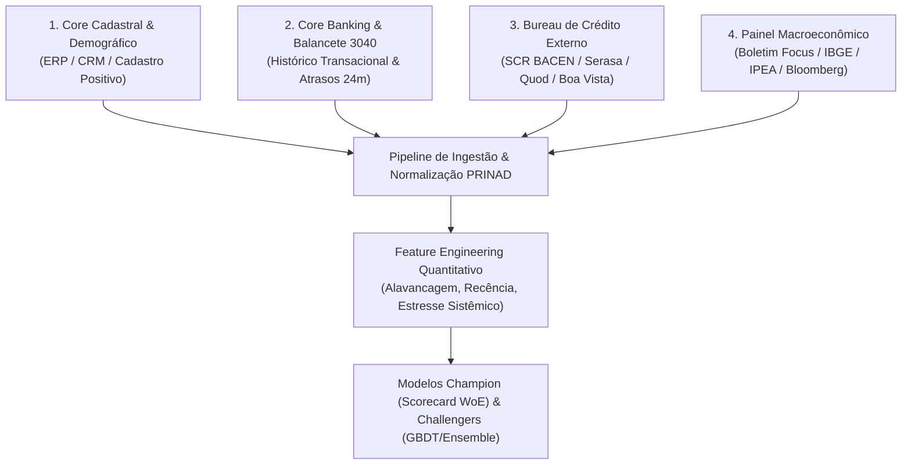
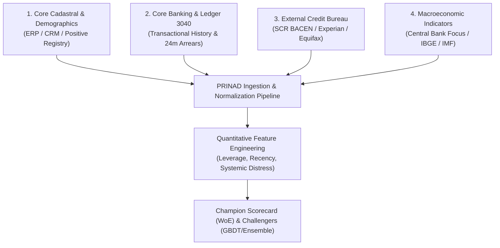

# 📘 PRINAD — Real-World Data Requirements & Banking Ingestion Guide / Guia Técnico de Requisitos de Dados Reais

<div align="center">

**Document Reference**: `PRINAD-DATA-REQ-V3.1`  
**Target Audience**: Data Engineers, Quant Risk Analysts, MLOps Engineers, Model Validators  
**Compliance**: Basel III/IV (IRB), IFRS 9 / BACEN Resolução 4.966, Resolução CMN 2.682/1999, Circular BACEN 3.644/2013 (DOC 3040 SCR)  

<h3>
  🌐 Escolha o Idioma / Choose Language:
</h3>

**[🇧🇷 Versão em Português](#-versão-em-português)** &nbsp;&nbsp;|&nbsp;&nbsp; **[🇺🇸 English Version](#-english-version)**

</div>

---

<details open>
<summary><h2 style="display:inline-block;" id="-versão-em-português">🇧🇷 Versão em Português (Clique para alternar / recolher)</h2></summary>

### 📑 Sumário
1. [Visão Geral da Arquitetura de Ingestão de Dados](#1-visão-geral-da-arquitetura-de-ingestão-de-dados)
2. [As 4 Fontes de Dados Fundamentais](#2-as-4-fontes-de-dados-fundamentais)
3. [Dicionário de Dados & Especificação do Schema](#3-dicionário-de-dados--especificação-do-schema)
4. [Mapeamento do Sistema de Informações de Crédito (SCR BACEN / DOC 3040)](#4-mapeamento-do-sistema-de-informações-de-crédito-scr-bacen--doc-3040)
5. [Exemplo Prático de Query SQL de Extração Bancária](#5-exemplo-prático-de-query-sql-de-extração-bancária)
6. [Governança, Higiene e Checklist de Qualidade de Dados](#6-governança-higiene-e-checklist-de-qualidade-de-dados)
7. [Como Garantir a Performance de Padrão Ouro (AUC > 0.95 / KS > 0.75)](#7-como-garantir-a-performance-de-padrão-ouro-auc--095--ks--075)

---

### 1. Visão Geral da Arquitetura de Ingestão de Dados

Para que o **PRINAD** atinja em produção uma performance equivalente ou superior aos benchmarks auditados (**ROC-AUC $\ge 0.96$, Gini $\ge 0.92$, KS $\ge 0.78$ e Brier Score $\le 0.059$**), a instituição operadora deve alimentar o motor com dados provenientes de **4 camadas canônicas de informação financeira**:



---

### 2. As 4 Fontes de Dados Fundamentais

- **Fonte 1: Dados Cadastrais e Demográficos**: Idade, escolaridade, estado civil, ocupação, tempo de relacionamento bancário e posse de moradia.
- **Fonte 2: Dados Comportamentais & Histórico Interno (Balancete 3040)**: Vetor de atrasos em cascata (`v205` a `v290`), limite concedido, limite utilizado e comprometimento de renda.
- **Fonte 3: Bureau Externo & SCR BACEN (DOC 3040)**: Rating regulatório Bacen (AA a H), dias de atraso no Sistema Financeiro Nacional (SFN), volume vencido e anotação de prejuízo.
- **Fonte 4: Painel Macroeconômico**: PIB real (% a.a.), taxa Selic (% a.a.) e taxa de desemprego nacional (%) para o Modelo de Vasicek ASRF.

---

### 3. Dicionário de Dados & Especificação do Schema

| Nome da Coluna | Tipo de Dado | Fonte | Obrigatório? | Faixa / Domínio de Valores | Descrição de Negócio | Tratamento de Nulos / Ausentes |
| :--- | :---: | :---: | :---: | :---: | :--- | :--- |
| `CPF` | `string` | Cadastral | **Sim** | 11 dígitos numéricos | Chave única do tomador de crédito pessoa física. | Erro se ausente. |
| `IDADE_CLIENTE` | `int` | Cadastral | **Sim** | 18 a 90 anos | Idade do tomador na data de referência da análise. | Mediana da carteira (38 anos). |
| `ESCOLARIDADE` | `string` | Cadastral | Não | `FUNDAM`, `MEDIO`, `SUPERIOR`, `POS` | Grau de instrução formal comprovado ou declarado. | Categoria `MEDIO` (moda). |
| `ESTADO_CIVIL` | `string` | Cadastral | Não | `CASADO`, `SOLTEIRO`, `DIVORCIADO`, `VIUVO` | Estado civil do proponente. | Categoria `SOLTEIRO`. |
| `OCUPACAO` | `string` | Cadastral | **Sim** | `SERVIDOR PUBLICO`, `ASSALARIADO`, `EMPRESARIO`, `AUTONOMO`, `APOSENTADO` | Categoria de ocupação principal geradora de renda. | Categoria `ASSALARIADO`. |
| `TIPO_RESIDENCIA` | `string` | Cadastral | Não | `PROPRIA`, `FINANCIADA`, `ALUGADA`, `CEDIDA` | Vínculo de posse do imóvel de moradia. | Categoria `OUTRO`. |
| `POSSUI_VEICULO` | `string` | Cadastral | Não | `SIM`, `NAO` | Indicação de propriedade de veículo automotor. | `NAO`. |
| `PORTABILIDADE` | `string` | Cadastral | Não | `SIM`, `NAO` | Cliente portabilizou salário para a instituição. | `NAO`. |
| `QT_DEPENDENTES` | `int` | Cadastral | Não | 0 a 10 | Quantidade de dependentes econômicos declarados. | 0 dependentes. |
| `TEMPO_RELAC` | `int` | Comportamental | **Sim** | 1 a 360 meses | Tempo de relacionamento (em meses) com a instituição. | 12 meses. |
| `RENDA_BRUTA` | `float` | Financeiro | **Sim** | $\ge \text{R\$} 1.412,00$ | Renda mensal bruta formal ou estimada pelo motor de renda. | Salário Mínimo Vigente. |
| `RENDA_LIQUIDA` | `float` | Financeiro | Não | $\ge \text{R\$} 1.000,00$ | Renda líquida após deduções fiscais e previdenciárias. | $80\%$ de `RENDA_BRUTA`. |
| `COMP_RENDA` | `float` | Financeiro | **Sim** | 0.00 a 1.00 ($0\%$ a $100\%$) | Comprometimento de renda mensal com dívidas e parcelas. | Média da carteira ($0.35$). |
| `limite_total` | `float` | Comportamental | **Sim** | $\ge \text{R\$} 0,00$ | Soma de todos os limites de crédito rotativo e pré-aprovados. | $3 \times \text{RENDA\_BRUTA}$. |
| `limite_utilizado` | `float` | Comportamental | **Sim** | $\ge \text{R\$} 0,00$ | Volume de crédito rotativo utilizado na data de corte. | $\text{limite\_total} \times \text{COMP\_RENDA}$. |
| `taxa_utilizacao` | `float` | Comportamental | **Sim** | 0.00 a 1.50 | Razão entre limite utilizado e limite total ($\frac{\text{utilizado}}{\text{total}}$). | Calculado automaticamente. |
| `v205` a `v290` | `float` | Balancete 3040 | **Sim** | $\ge 0.0$ | Faixas de atraso de 15 dias até 360+ dias / Prejuízo. | 0.0 (Sem atraso). |
| `scr_classificacao_risco` | `string` | SCR BACEN | **Sim** | `AA` a `H` | Rating regulatório no SFN (Res. 2.682/99 / Res. 4.966). | `B` (Risco médio). |
| `scr_score_risco` | `int` | SCR BACEN | **Sim** | 0 a 8 | Equivalente numérico do rating SCR (`AA=0, A=1, ..., H=8`). | 2 (`B`). |
| `scr_dias_atraso` | `int` | SCR BACEN | **Sim** | 0 a 1000+ dias | Quantidade máxima de dias de atraso apontados no SFN. | 0 dias. |
| `scr_valor_vencido` | `float` | SCR BACEN | **Sim** | $\ge 0.0$ | Valor total vencido no SFN (R$). | 0.0. |
| `scr_valor_prejuizo` | `float` | SCR BACEN | **Sim** | $\ge 0.0$ | Valor baixado como prejuízo contábil no SFN (R$). | 0.0. |
| `scr_tem_prejuizo` | `int` | SCR BACEN | **Sim** | 0 ou 1 | Flag binária de prejuízo no SCR ($1=\text{Sim}, 0=\text{Não}$). | 0. |

---

### 4. Mapeamento do Sistema de Informações de Crédito (SCR BACEN / DOC 3040)

| Código no Layout 3040 Bacen | Descrição no Manual Bacen | Campo Correspondente no PRINAD | Impacto no Modelo de PD |
| :--- | :--- | :--- | :--- |
| **Vencimento V205** | Créditos a vencer ou vencidos de 15 a 30 dias | `v205` | Alerta de liquidez inicial de curto prazo |
| **Vencimento V210** | Créditos vencidos de 31 a 60 dias | `v210` | **Gatilho SICR (IFRS 9 Stage 2)** |
| **Vencimento V220** | Créditos vencidos de 61 a 90 dias | `v220` | Risco pré-default com perda de pontuação |
| **Vencimento V240 / V290** | Créditos vencidos $>90$ dias até $>360$ dias | `v240`, `v290`, `max_dias_atraso_12m` | **Definição Regulatória de Default (Stage 3)** |
| **Classificação de Risco (CR)** | Rating de crédito consolidado (Art. 3º Res. 2.682) | `scr_classificacao_risco` & `scr_score_risco` | Calibração de odds de longo prazo (TTC) |
| **Operações Baixadas como Prejuízo** | Créditos em perdas contábeis após 180-360 dias | `scr_valor_prejuizo` & `scr_tem_prejuizo` | Bloqueio imediato de crédito |

---

### 5. Exemplo Prático de Query SQL de Extração Bancária

```sql
WITH Cadastral AS (
    SELECT 
        c.cpf_limpo AS CPF,
        c.cliente_id AS CLIT,
        EXTRACT(YEAR FROM AGE(CURRENT_DATE, c.data_nascimento)) AS IDADE_CLIENTE,
        UPPER(COALESCE(c.grau_escolaridade, 'MEDIO')) AS ESCOLARIDADE,
        UPPER(COALESCE(c.estado_civil, 'SOLTEIRO')) AS ESTADO_CIVIL,
        UPPER(COALESCE(c.tipo_ocupacao, 'ASSALARIADO')) AS OCUPACAO,
        UPPER(COALESCE(c.tipo_moradia, 'PROPRIA')) AS TIPO_RESIDENCIA,
        CASE WHEN c.qtd_veiculos > 0 THEN 'SIM' ELSE 'NAO' END AS POSSUI_VEICULO,
        CASE WHEN c.portabilidade_salario = TRUE THEN 'SIM' ELSE 'NAO' END AS PORTABILIDADE,
        COALESCE(c.qtd_dependentes, 0) AS QT_DEPENDENTES,
        MONTHS_BETWEEN(CURRENT_DATE, c.data_abertura_conta) AS TEMPO_RELAC,
        COALESCE(c.renda_mensal_bruta, 1500.0) AS RENDA_BRUTA,
        COALESCE(c.renda_mensal_liquida, c.renda_mensal_bruta * 0.82) AS RENDA_LIQUIDA
    FROM tb_clientes c
    WHERE c.status_cliente = 'ATIVO'
),
Financeiro AS (
    SELECT 
        f.cliente_id,
        COALESCE(f.limite_total_credito, 0.0) AS limite_total,
        COALESCE(f.limite_utilizado_rotativo, 0.0) AS limite_utilizado,
        COALESCE(f.soma_parcelas_vigentes, 0.0) AS parcelas_mensais,
        ROUND(LEAST(1.0, (f.soma_parcelas_vigentes + f.limite_utilizado_rotativo * 0.10) / NULLIF(c.RENDA_BRUTA, 0)), 4) AS COMP_RENDA
    FROM tb_posicao_financeira f
    JOIN Cadastral c ON f.cliente_id = c.CLIT
),
Comportamental3040 AS (
    SELECT 
        b.cliente_id,
        COALESCE(SUM(CASE WHEN b.dias_atraso BETWEEN 15 AND 30 THEN b.saldo_devedor ELSE 0 END), 0.0) AS v205,
        COALESCE(SUM(CASE WHEN b.dias_atraso BETWEEN 31 AND 60 THEN b.saldo_devedor ELSE 0 END), 0.0) AS v210,
        COALESCE(SUM(CASE WHEN b.dias_atraso BETWEEN 61 AND 90 THEN b.saldo_devedor ELSE 0 END), 0.0) AS v220,
        COALESCE(SUM(CASE WHEN b.dias_atraso BETWEEN 121 AND 150 THEN b.saldo_devedor ELSE 0 END), 0.0) AS v240,
        COALESCE(SUM(CASE WHEN b.dias_atraso > 180 THEN b.saldo_devedor ELSE 0 END), 0.0) AS v290,
        MAX(COALESCE(b.dias_atraso, 0)) AS max_dias_atraso_12m
    FROM tb_historico_contratos_24m b
    GROUP BY b.cliente_id
),
BureauSCR AS (
    SELECT 
        s.cpf AS CPF,
        UPPER(COALESCE(s.classificacao_risco_bacen, 'B')) AS scr_classificacao_risco,
        CASE UPPER(COALESCE(s.classificacao_risco_bacen, 'B'))
            WHEN 'AA' THEN 0 WHEN 'A' THEN 1 WHEN 'B' THEN 2 WHEN 'C' THEN 3
            WHEN 'D' THEN 4 WHEN 'E' THEN 5 WHEN 'F' THEN 6 WHEN 'G' THEN 7 ELSE 8
        END AS scr_score_risco,
        COALESCE(s.dias_atraso_sfn, 0) AS scr_dias_atraso,
        COALESCE(s.valor_total_vencido, 0.0) AS scr_valor_vencido,
        COALESCE(s.valor_total_prejuizo, 0.0) AS scr_valor_prejuizo,
        CASE WHEN s.valor_total_prejuizo > 0 THEN 1 ELSE 0 END AS scr_tem_prejuizo
    FROM tb_bureau_scr_consolidado s
)
SELECT 
    c.CPF, c.CLIT, c.IDADE_CLIENTE, c.ESCOLARIDADE, c.ESTADO_CIVIL, c.OCUPACAO, c.TIPO_RESIDENCIA,
    c.POSSUI_VEICULO, c.PORTABILIDADE, c.QT_DEPENDENTES, c.TEMPO_RELAC, c.RENDA_BRUTA, c.RENDA_LIQUIDA,
    f.COMP_RENDA, f.limite_total, f.limite_utilizado,
    ROUND(LEAST(1.5, f.limite_utilizado / NULLIF(f.limite_total, 0)), 4) AS taxa_utilizacao,
    f.parcelas_mensais,
    GREATEST(0.0, c.RENDA_BRUTA * 0.35 - f.parcelas_mensais) AS margem_disponivel,
    comp.v205, comp.v210, comp.v220, comp.v240, comp.v290, comp.max_dias_atraso_12m,
    scr.scr_classificacao_risco, scr.scr_score_risco, scr.scr_dias_atraso, scr.scr_valor_vencido,
    scr.scr_valor_prejuizo, scr.scr_tem_prejuizo
FROM Cadastral c
JOIN Financeiro f ON c.CLIT = f.cliente_id
LEFT JOIN Comportamental3040 comp ON c.CLIT = comp.cliente_id
LEFT JOIN BureauSCR scr ON c.CPF = scr.CPF;
```

---

### 6. Governança, Higiene e Checklist de Qualidade de Dados

- **Normalização de CPF**: Remoção automática de pontuação (`normalize_cpf`).
- **Cap de Outliers**: Renda e limites limitados ao percentil 99,5%.
- **Limites Físicos**: Comprometimento de renda fixado em $[0.0, 1.0]$ e taxa de utilização em $[0.0, 1.5]$.
- **Imputação de Nulos**: Numéricos preenchidos com 0.0 ou medianas da safra; categóricos imputados com a moda.

---

### 7. Como Garantir a Performance de Padrão Ouro (AUC > 0.95 / KS > 0.75)

1. Garantir a extração fidedigna do vetor de atrasos de 24 meses (`v205` a `v290`).
2. Atualizar a foto do Bureau SCR BACEN mensalmente para detectar alavancagem externa no SFN.
3. Monitorar o PSI semanalmente no dashboard Streamlit (recalibrar se $\text{PSI} > 0.10$).
4. Alimentar o painel macroeconômico real (PIB, Selic e Desemprego do Boletim Focus) mensalmente.

</details>

---

<details>
<summary><h2 style="display:inline-block;" id="-english-version">🇺🇸 English Version (Click to open / expand)</h2></summary>

### 📑 Table of Contents
1. [Data Ingestion Architecture Overview](#1-data-ingestion-architecture-overview)
2. [The 4 Core Banking Data Layers](#2-the-4-core-banking-data-layers)
3. [Data Dictionary & Schema Specification](#3-data-dictionary--schema-specification)
4. [Central Bank Credit Register (SCR BACEN / DOC 3040) Mapping](#4-central-bank-credit-register-scr-bacen--doc-3040-mapping)
5. [Canonical SQL Banking Extraction Script](#5-canonical-sql-banking-extraction-script)
6. [Data Governance, Hygiene & Sanity Checks](#6-data-governance-hygiene--sanity-checks)
7. [How to Guarantee Tier-1 Performance (AUC > 0.95 / KS > 0.75)](#7-how-to-guarantee-tier-1-performance-auc--095--ks--075)

---

### 1. Data Ingestion Architecture Overview

To achieve production model performance on par with our audited benchmarks (**ROC-AUC $\ge 0.96$, Gini $\ge 0.92$, KS $\ge 0.78$, and Brier Score $\le 0.059$**), financial institutions must feed PRINAD with data from **4 canonical banking layers**:



---

### 2. The 4 Core Banking Data Layers

- **Layer 1: Cadastral & Demographics**: Age, education level, marital status, occupation category, relationship tenure, home ownership.
- **Layer 2: Internal Behavioral & Ledger (DOC 3040)**: Delinquency buckets (`v205` to `v290`), granted credit limit, used revolving credit, debt service-to-income.
- **Layer 3: External Bureau (Central Bank SCR / DOC 3040)**: Regulatory risk rating (AA to H), SFN days past due, overdue balances, write-offs.
- **Layer 4: Macroeconomic State**: Annual real GDP growth (%), benchmark interest rate (%), and unemployment rate (%) feeding the Vasicek ASRF model.

---

### 3. Data Dictionary & Schema Specification

| Column Name | Data Type | Source | Mandatory? | Value Domain / Range | Business Meaning | Missing Value Treatment |
| :--- | :---: | :---: | :---: | :---: | :--- | :--- |
| `CPF` | `string` | Cadastral | **Yes** | 11-digit string | Unique natural person borrower tax ID. | Error if absent. |
| `IDADE_CLIENTE` | `int` | Cadastral | **Yes** | 18 to 90 years | Borrower age at reference date. | Portfolio median (38). |
| `ESCOLARIDADE` | `string` | Cadastral | No | `FUNDAM`, `MEDIO`, `SUPERIOR`, `POS` | Proven or declared formal education level. | `MEDIO` (mode). |
| `ESTADO_CIVIL` | `string` | Cadastral | No | `CASADO`, `SOLTEIRO`, `DIVORCIADO`, `VIUVO` | Marital status. | `SOLTEIRO`. |
| `OCUPACAO` | `string` | Cadastral | **Yes** | `SERVIDOR PUBLICO`, `ASSALARIADO`, `EMPRESARIO`, `AUTONOMO`, `APOSENTADO` | Primary occupation generating income. | `ASSALARIADO`. |
| `TIPO_RESIDENCIA` | `string` | Cadastral | No | `PROPRIA`, `FINANCIADA`, `ALUGADA`, `CEDIDA` | Residential property tenure. | `OUTRO`. |
| `POSSUI_VEICULO` | `string` | Cadastral | No | `SIM`, `NAO` | Vehicle ownership flag. | `NAO`. |
| `PORTABILIDADE` | `string` | Cadastral | No | `SIM`, `NAO` | Payroll portability to institution flag. | `NAO`. |
| `QT_DEPENDENTES` | `int` | Cadastral | No | 0 to 10 | Number of declared economic dependents. | 0 dependents. |
| `TEMPO_RELAC` | `int` | Behavioral | **Yes** | 1 to 360 months | Relationship tenure with institution in months. | 12 months. |
| `RENDA_BRUTA` | `float` | Financial | **Yes** | $\ge \text{R\$} 1,412.00$ | Monthly gross income (verified or modeled). | Minimum Wage. |
| `RENDA_LIQUIDA` | `float` | Financial | No | $\ge \text{R\$} 1,000.00$ | Net disposable income after taxes. | $80\%$ of `RENDA_BRUTA`. |
| `COMP_RENDA` | `float` | Financial | **Yes** | 0.00 to 1.00 (0% to 100%) | Debt-to-income commitment ratio. | Portfolio mean ($0.35$). |
| `limite_total` | `float` | Behavioral | **Yes** | $\ge 0.0$ | Aggregate approved revolving credit limit. | $3 \times \text{RENDA\_BRUTA}$. |
| `limite_utilizado` | `float` | Behavioral | **Yes** | $\ge 0.0$ | Revolving credit limit drawn at cut-off date. | $\text{limite\_total} \times \text{COMP\_RENDA}$. |
| `taxa_utilizacao` | `float` | Behavioral | **Yes** | 0.00 to 1.50 | Credit utilization ratio ($\frac{\text{used}}{\text{total}}$). | Calculated automatically. |
| `v205` to `v290` | `float` | Ledger 3040 | **Yes** | $\ge 0.0$ | Delinquency buckets from 15 days to 360+ days / Write-offs. | 0.0 (No arrears). |
| `scr_classificacao_risco` | `string` | SCR Bureau | **Yes** | `AA` to `H` | Regulatory credit rating in National Financial System. | `B` (Moderate risk). |
| `scr_score_risco` | `int` | SCR Bureau | **Yes** | 0 to 8 | Numeric equivalent of SCR rating (`AA=0, ..., H=8`). | 2 (`B`). |
| `scr_dias_atraso` | `int` | SCR Bureau | **Yes** | 0 to 1000+ days | Maximum delinquency days reported in SFN bureau. | 0 days. |
| `scr_valor_vencido` | `float` | SCR Bureau | **Yes** | $\ge 0.0$ | Total overdue balance in SFN bureau. | 0.0. |
| `scr_valor_prejuizo` | `float` | SCR Bureau | **Yes** | $\ge 0.0$ | Total written-off debt in SFN bureau. | 0.0. |
| `scr_tem_prejuizo` | `int` | SCR Bureau | **Yes** | 0 or 1 | Binary write-off flag ($1=\text{Yes}, 0=\text{No}$). | 0. |

---

### 4. Central Bank Credit Register (SCR BACEN / DOC 3040) Mapping

- **V205 Bucket (15-30 days past due)**: Early warning indicator of short-term liquidity stress.
- **V210 Bucket (31-60 days past due)**: **Primary trigger for IFRS 9 Stage 2 (SICR)**.
- **V220 Bucket (61-90 days past due)**: High risk pre-default deterioration.
- **V240 to V290 Buckets (>90 to >360 days past due)**: **Regulatory Default Definition (IFRS 9 Stage 3 / Impairment)**.
- **Risk Classification (AA to H)**: Long-term Through-the-Cycle (TTC) baseline odds.
- **Write-Off Flags**: Immediate credit decline / severe impairment charge.

---

### 5. Canonical SQL Banking Extraction Script

```sql
WITH Cadastral AS (
    SELECT 
        c.cpf_clean AS CPF,
        c.client_id AS CLIT,
        EXTRACT(YEAR FROM AGE(CURRENT_DATE, c.birth_date)) AS IDADE_CLIENTE,
        UPPER(COALESCE(c.education_level, 'MEDIO')) AS ESCOLARIDADE,
        UPPER(COALESCE(c.marital_status, 'SOLTEIRO')) AS ESTADO_CIVIL,
        UPPER(COALESCE(c.occupation_type, 'ASSALARIADO')) AS OCUPACAO,
        UPPER(COALESCE(c.residence_type, 'PROPRIA')) AS TIPO_RESIDENCIA,
        CASE WHEN c.vehicle_count > 0 THEN 'SIM' ELSE 'NAO' END AS POSSUI_VEICULO,
        CASE WHEN c.payroll_portability = TRUE THEN 'SIM' ELSE 'NAO' END AS PORTABILIDADE,
        COALESCE(c.dependent_count, 0) AS QT_DEPENDENTES,
        MONTHS_BETWEEN(CURRENT_DATE, c.account_open_date) AS TEMPO_RELAC,
        COALESCE(c.gross_monthly_income, 1500.0) AS RENDA_BRUTA,
        COALESCE(c.net_monthly_income, c.gross_monthly_income * 0.82) AS RENDA_LIQUIDA
    FROM tb_clients c
    WHERE c.status = 'ACTIVE'
),
Financial AS (
    SELECT 
        f.client_id,
        COALESCE(f.total_credit_limit, 0.0) AS limite_total,
        COALESCE(f.used_revolving_limit, 0.0) AS limite_utilizado,
        COALESCE(f.active_installments_sum, 0.0) AS parcelas_mensais,
        ROUND(LEAST(1.0, (f.active_installments_sum + f.used_revolving_limit * 0.10) / NULLIF(c.RENDA_BRUTA, 0)), 4) AS COMP_RENDA
    FROM tb_financial_position f
    JOIN Cadastral c ON f.client_id = c.CLIT
),
Behavioral3040 AS (
    SELECT 
        b.client_id,
        COALESCE(SUM(CASE WHEN b.dpd BETWEEN 15 AND 30 THEN b.balance ELSE 0 END), 0.0) AS v205,
        COALESCE(SUM(CASE WHEN b.dpd BETWEEN 31 AND 60 THEN b.balance ELSE 0 END), 0.0) AS v210,
        COALESCE(SUM(CASE WHEN b.dpd BETWEEN 61 AND 90 THEN b.balance ELSE 0 END), 0.0) AS v220,
        COALESCE(SUM(CASE WHEN b.dpd BETWEEN 121 AND 150 THEN b.balance ELSE 0 END), 0.0) AS v240,
        COALESCE(SUM(CASE WHEN b.dpd > 180 THEN b.balance ELSE 0 END), 0.0) AS v290,
        MAX(COALESCE(b.dpd, 0)) AS max_dias_atraso_12m
    FROM tb_loan_contracts_24m b
    GROUP BY b.client_id
),
BureauSCR AS (
    SELECT 
        s.cpf AS CPF,
        UPPER(COALESCE(s.rating_bacen, 'B')) AS scr_classificacao_risco,
        CASE UPPER(COALESCE(s.rating_bacen, 'B'))
            WHEN 'AA' THEN 0 WHEN 'A' THEN 1 WHEN 'B' THEN 2 WHEN 'C' THEN 3
            WHEN 'D' THEN 4 WHEN 'E' THEN 5 WHEN 'F' THEN 6 WHEN 'G' THEN 7 ELSE 8
        END AS scr_score_risco,
        COALESCE(s.sfn_dpd, 0) AS scr_dias_atraso,
        COALESCE(s.sfn_overdue_balance, 0.0) AS scr_valor_vencido,
        COALESCE(s.sfn_writeoff_balance, 0.0) AS scr_valor_prejuizo,
        CASE WHEN s.sfn_writeoff_balance > 0 THEN 1 ELSE 0 END AS scr_tem_prejuizo
    FROM tb_bureau_scr_consolidated s
)
SELECT 
    c.CPF, c.CLIT, c.IDADE_CLIENTE, c.ESCOLARIDADE, c.ESTADO_CIVIL, c.OCUPACAO, c.TIPO_RESIDENCIA,
    c.POSSUI_VEICULO, c.PORTABILIDADE, c.QT_DEPENDENTES, c.TEMPO_RELAC, c.RENDA_BRUTA, c.RENDA_LIQUIDA,
    f.COMP_RENDA, f.limite_total, f.limite_utilizado,
    ROUND(LEAST(1.5, f.limite_utilizado / NULLIF(f.limite_total, 0)), 4) AS taxa_utilizacao,
    f.parcelas_mensais,
    GREATEST(0.0, c.RENDA_BRUTA * 0.35 - f.parcelas_mensais) AS margem_disponivel,
    comp.v205, comp.v210, comp.v220, comp.v240, comp.v290, comp.max_dias_atraso_12m,
    scr.scr_classificacao_risco, scr.scr_score_risco, scr.scr_dias_atraso, scr.scr_valor_vencido,
    scr.scr_valor_prejuizo, scr.scr_tem_prejuizo
FROM Cadastral c
JOIN Financial f ON c.CLIT = f.client_id
LEFT JOIN Behavioral3040 comp ON c.CLIT = comp.client_id
LEFT JOIN BureauSCR scr ON c.CPF = scr.CPF;
```

---

### 6. Data Governance, Hygiene & Sanity Checks

- **CPF Normalization**: Automatic non-digit cleaning via `normalize_cpf`.
- **Outlier Capping**: Income and credit limits clipped at 99.5th percentile.
- **Physical Bounds**: Debt commitment ratio constrained to $[0.0, 1.0]$, utilization ratio constrained to $[0.0, 1.5]$.
- **Imputation**: Numerical nulls filled with 0.0 or vintage medians; categorical nulls filled with mode.

---

### 7. How to Guarantee Tier-1 Performance (AUC > 0.95 / KS > 0.75)

1. Ensure continuous availability of the 24-month arrears lookback vector (`v205` to `v290`).
2. Refresh the Central Bank SCR Bureau snapshot monthly to detect systemic over-indebtedness.
3. Monitor the Population Stability Index ($\text{PSI}$) weekly (trigger retraining if $\text{PSI} > 0.10$).
4. Update macroeconomic indicators (GDP, Selic rate, Unemployment) monthly in the Vasicek engine.

</details>
