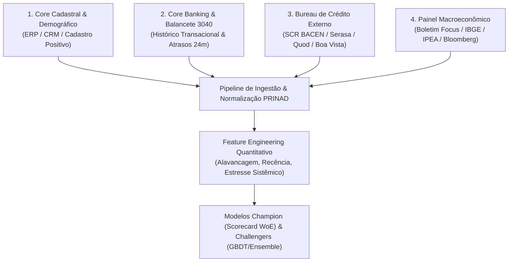

# 📘 PRINAD — Guia Técnico de Requisitos de Dados Reais & Mapeamento Bancário

**Documento**: `PRINAD-DATA-REQ-V3.1`  
**Público-Alvo**: Engenheiros de Dados, Cientistas de Dados, Analistas de Risco de Crédito, Engenheiros de MLOps e Auditores de Risco  
**Padrão Regulatório**: Basileia III/IV (IRB), IFRS 9 / BACEN Resolução 4.966, Resolução CMN 2.682/1999 e Circular BACEN 3.644/2013 (DOC 3040 SCR)  

---

## 📑 Sumário
1. [Visão Geral da Arquitetura de Ingestão de Dados](#1-visão-geral-da-arquitetura-de-ingestão-de-dados)
2. [As 4 Fontes de Dados Fundamentais](#2-as-4-fontes-de-dados-fundamentais)
3. [Dicionário de Dados & Especificação do Schema](#3-dicionário-de-dados--especificação-do-schema)
4. [Mapeamento do Sistema de Informações de Crédito (SCR BACEN / DOC 3040)](#4-mapeamento-do-sistema-de-informações-de-crédito-scr-bacen--doc-3040)
5. [Exemplo Prático de Query SQL de Extração Bancária](#5-exemplo-prático-de-query-sql-de-extração-bancária)
6. [Governança, Higiene e Checklist de Qualidade de Dados](#6-governança-higiene-e-checklist-de-qualidade-de-dados)
7. [Como Garantir a Performance de Padrão Ouro (AUC > 0.95 / KS > 0.75)](#7-como-garantir-a-performance-de-padrão-ouro-auc--095--ks--075)

---

## 1. Visão Geral da Arquitetura de Ingestão de Dados

Para que o **PRINAD** atinja em produção uma performance equivalente ou superior aos benchmarks auditados (**ROC-AUC $\ge 0.96$, Gini $\ge 0.92$, KS $\ge 0.78$ e Brier Score $\le 0.059$**), a instituição operadora deve alimentar o motor com dados provenientes de **4 camadas canônicas de informação financeira**:



---

## 2. As 4 Fontes de Dados Fundamentais

### 🏢 Fonte 1: Dados Cadastrais e Demográficos (Internal Cadastral Data)
- **Origem**: Sistema de Cadastro de Clientes (Core Banking / CRM / Onboarding Digital).
- **Finalidade**: Mensurar a estabilidade sociodemográfica e a maturidade de relacionamento do tomador.
- **Campos Típicos**: Idade, escolaridade, estado civil, ocupação profissional, tempo de conta corrente, tipo de moradia.

### 💳 Fonte 2: Dados Comportamentais & Histórico Interno (Internal Behavioral / Ledger)
- **Origem**: Sistema de Empréstimos, Cartões e Contas Correntes (Core Banking Ledger).
- **Finalidade**: Avaliar o histórico de cumprimento de obrigações com a própria instituição nos últimos 12 a 24 meses (Roll-rates e matriz de atrasos).
- **Campos Típicos**: Faixas de atraso em cascata (`v205` a `v290` do DOC 3040), limite concedido, limite utilizado, comprometimento de renda.

### 🏛️ Fonte 3: Bureau Externo & Central Bank Credit Register (SCR BACEN / DOC 3040)
- **Origem**: Sistema de Informações de Crédito do Banco Central do Brasil (**SCR / Registrato**) ou bureaus privados (**Serasa Experian, Boa Vista SCPC, Quod, TransUnion**).
- **Finalidade**: Detectar alavancagem externa, histórico de inadimplência no Sistema Financeiro Nacional (SFN) e créditos baixados como prejuízo em outras instituições.
- **Campos Típicos**: Rating regulatório Bacen (AA a H), dias de atraso no SFN, volume vencido, anotação de prejuízo.

### 🌐 Fonte 4: Painel Macroeconômico (Systemic Forward-Looking Inputs)
- **Origem**: Banco Central (SGS / API do BACEN), IBGE, IPEADATA, Relatório Focus.
- **Finalidade**: Alimentar a Equação de Vasicek ASRF para estresse macroeconômico e estadiamento forward-looking IFRS 9 / BACEN 4.966.
- **Campos Típicos**: Taxa Básica SELIC anualizada (%), Taxa de Crescimento Real do PIB (% a.a.), Taxa de Desemprego Nacional PNAD Contínua (%).

---

## 3. Dicionário de Dados & Especificação do Schema

A tabela abaixo descreve cada variável que a pessoa ou equipe de risco precisa disponibilizar para alimentar o motor do PRINAD:

| Nome da Coluna | Tipo de Dado | Fonte | Obrigatório? | Faixa / Domínio de Valores | Descrição de Negócio | Tratamento de Nulos / Ausentes |
| :--- | :---: | :---: | :---: | :---: | :--- | :--- |
| `CPF` | `string` | Cadastral | **Sim** | 11 dígitos numéricos | Chave única do tomador de crédito pessoa física. | Erro se ausente. |
| `IDADE_CLIENTE` | `int` | Cadastral | **Sim** | 18 a 90 anos | Idade do tomador na data de referência da análise. | Mediana da carteira (38 anos). |
| `ESCOLARIDADE` | `string` | Cadastral | Não | `FUNDAM`, `MEDIO`, `SUPERIOR`, `POS` | Grau de instrução formal comprovado ou declarado. | Categoria `MEDIO` (moda). |
| `ESTADO_CIVIL` | `string` | Cadastral | Não | `CASADO`, `SOLTEIRO`, `DIVORCIADO`, `VIUVO` | Estado civil do proponente. | Categoria `SOLTEIRO`. |
| `OCUPACAO` | `string` | Cadastral | **Sim** | `SERVIDOR PUBLICO`, `ASSALARIADO`, `EMPRESARIO`, `AUTONOMO`, `APOSENTADO` | Categoria de ocupação principal geradora de renda. | Categoria `ASSALARIADO`. |
| `TIPO_RESIDENCIA` | `string` | Cadastral | Não | `PROPRIA`, `FINANCIADA`, `ALUGADA`, `CEDIDA` | Vínculo de posse do imóvel de moradia. | Categoria `OUTRO`. |
| `POSSUI_VEICULO` | `string` | Cadastral | Não | `SIM`, `NAO` | Indicação de propriedade de veículo automotor. | `NAO`. |
| `PORTABILIDADE` | `string` | Cadastral | Não | `SIM`, `NAO` | Cliente portabilizou salário para a instituição. | `NAO`. |
| `QT_DEPENDENTES` | `int` | Cadastral | Não | 0 a 10 | Quantidade de dependentes econômicos declarados. | 0 dependentes. |
| `TEMPO_RELAC` | `int` | Comportamental | **Sim** | 1 a 360 meses | Tempo de relacionamento (em meses) com a instituição. | 12 meses. |
| `RENDA_BRUTA` | `float` | Financeiro | **Sim** | $\ge \text{R\$} 1.412,00$ | Renda mensal bruta formal ou estimada pelo motor de renda. | Salário Mínimo Vigente. |
| `RENDA_LIQUIDA` | `float` | Financeiro | Não | $\ge \text{R\$} 1.000,00$ | Renda líquida após deduções fiscais e previdenciárias. | $80\%$ de `RENDA_BRUTA`. |
| `COMP_RENDA` | `float` | Financeiro | **Sim** | 0.00 a 1.00 ($0\%$ a $100\%$) | Comprometimento de renda mensal com dívidas e parcelas. | Média da carteira ($0.35$). |
| `limite_total` | `float` | Comportamental | **Sim** | $\ge \text{R\$} 0,00$ | Soma de todos os limites de crédito rotativo e pré-aprovados. | $3 \times \text{RENDA\_BRUTA}$. |
| `limite_utilizado` | `float` | Comportamental | **Sim** | $\ge \text{R\$} 0,00$ | Volume de crédito rotativo utilizado na data de corte. | $\text{limite\_total} \times \text{COMP\_RENDA}$. |
| `taxa_utilizacao` | `float` | Comportamental | **Sim** | 0.00 a 1.50 | Razão entre limite utilizado e limite total ($\frac{\text{utilizado}}{\text{total}}$). | Calculado automaticamente. |
| `parcelas_mensais` | `float` | Financeiro | Não | $\ge \text{R\$} 0,00$ | Valor total mensal pago em contratos de parcelamento vigentes. | $\text{RENDA\_BRUTA} \times \text{COMP\_RENDA}$. |
| `margem_disponivel` | `float` | Financeiro | Não | $\ge \text{R\$} 0,00$ | Margem consignável ou capacidade de pagamento livre. | Calculado: $\max(0, 0.35 \times \text{Renda} - \text{Parcelas})$. |
| `v205` | `float` | Balancete 3040 | **Sim** | $\ge 0.0$ | Saldo devedor com atraso de **15 a 30 dias** nos últimos 24m. | 0.0 (Sem atraso). |
| `v210` | `float` | Balancete 3040 | **Sim** | $\ge 0.0$ | Saldo devedor com atraso de **31 a 60 dias** nos últimos 24m. | 0.0 (Sem atraso). |
| `v220` | `float` | Balancete 3040 | **Sim** | $\ge 0.0$ | Saldo devedor com atraso de **61 a 90 dias** nos últimos 24m. | 0.0 (Sem atraso). |
| `v230` | `float` | Balancete 3040 | Não | $\ge 0.0$ | Saldo devedor com atraso de **91 a 120 dias** nos últimos 24m. | 0.0 (Sem atraso). |
| `v240` | `float` | Balancete 3040 | **Sim** | $\ge 0.0$ | Saldo devedor com atraso de **121 a 150 dias** nos últimos 24m. | 0.0 (Sem atraso). |
| `v245` a `v290` | `float` | Balancete 3040 | **Sim** | $\ge 0.0$ | Saldos com atrasos superiores a **151 a 360+ dias / Prejuízo**. | 0.0 (Sem atraso). |
| `scr_classificacao_risco` | `string` | SCR BACEN | **Sim** | `AA`, `A`, `B`, `C`, `D`, `E`, `F`, `G`, `H` | Classificação de risco regulatória do cliente no SFN (Res. 2.682/99). | `B` (Risco médio). |
| `scr_score_risco` | `int` | SCR BACEN | **Sim** | 0 a 8 | Equivalente numérico do rating SCR (`AA=0, A=1, ..., H=8`). | 2 (`B`). |
| `scr_dias_atraso` | `int` | SCR BACEN | **Sim** | 0 a 1000+ dias | Quantidade máxima de dias de atraso apontados no SCR no SFN. | 0 dias. |
| `scr_valor_vencido` | `float` | SCR BACEN | **Sim** | $\ge 0.0$ | Valor total de operações vencidas apontadas no SCR no SFN (R$). | 0.0. |
| `scr_valor_prejuizo` | `float` | SCR BACEN | **Sim** | $\ge 0.0$ | Valor total baixado como prejuízo contábil no SFN (R$). | 0.0. |
| `scr_tem_prejuizo` | `int` | SCR BACEN | **Sim** | 0 ou 1 | Flag binária indicativa de anotação de prejuízo no SCR ($1=\text{Sim}, 0=\text{Não}$). | 0. |

---

## 4. Mapeamento do Sistema de Informações de Crédito (SCR BACEN / DOC 3040)

O **SCR BACEN (Documento 3040)** é o padrão regulatório oficial do Banco Central do Brasil para centralização de risco de crédito. O PRINAD foi desenhado para se acoplar nativamente à taxonomia do 3040:

### Matriz de Mapeamento do Layout 3040 para o PRINAD

| Código no Layout 3040 Bacen | Descrição no Manual Bacen | Campo Correspondente no PRINAD | Impacto no Modelo de PD |
| :--- | :--- | :--- | :--- |
| **Vencimento V205** | Créditos a vencer ou vencidos de 15 a 30 dias | `v205` | Alerta de liquidez inicial de curto prazo |
| **Vencimento V210** | Créditos vencidos de 31 a 60 dias | `v210` | **Gatilho SICR (IFRS 9 Stage 2)** |
| **Vencimento V220** | Créditos vencidos de 61 a 90 dias | `v220` | Risco pré-default com perda de pontuação |
| **Vencimento V240 / V290** | Créditos vencidos $>90$ dias até $>360$ dias | `v240`, `v290`, `max_dias_atraso_12m` | **Definição Regulatória de Default (Stage 3)** |
| **Classificação de Risco (CR)** | Rating de crédito consolidado (Art. 3º Res. 2.682) | `scr_classificacao_risco` & `scr_score_risco` | Calibração de odds de longo prazo (TTC) |
| **Operações Baixadas como Prejuízo** | Créditos em perdas contábeis após 180-360 dias | `scr_valor_prejuizo` & `scr_tem_prejuizo` | Redutor drástico de score e bloqueio de concessão |

---

## 5. Exemplo Prático de Query SQL de Extração Bancária

Abaixo está um exemplo canônico em **SQL (compatível com PostgreSQL, Oracle e Snowflake)** demonstrando como um Engenheiro de Dados pode consolidar as tabelas internas do banco para gerar exatamente o arquivo de entrada do PRINAD:

```sql
-- ============================================================================
-- EXTRAÇÃO CANÔNICA DE DADOS REAIS PARA O MOTOR PRINAD
-- Executar contra o Data Lakehouse / Data Warehouse de Crédito da Instituição
-- ============================================================================
WITH Cadastral AS (
    SELECT 
        c.cpf_limpo AS CPF,
        c.cliente_id AS CLIT,
        EXTRACT(YEAR FROM AGE(CURRENT_DATE, c.data_nascimento)) AS IDADE_CLIENTE,
        UPPER(COALESCE(c.grau_escolaridade, 'MEDIO')) AS ESCOLARIDADE,
        UPPER(COALESCE(c.estado_civil, 'SOLTEIRO')) AS ESTADO_CIVIL,
        UPPER(COALESCE(c.tipo_ocupacao, 'ASSALARIADO')) AS OCUPACAO,
        UPPER(COALESCE(c.tipo_moradia, 'PROPRIA')) AS TIPO_RESIDENCIA,
        CASE WHEN c.qtd_veiculos > 0 THEN 'SIM' ELSE 'NAO' END AS POSSUI_VEICULO,
        CASE WHEN c.portabilidade_salario = TRUE THEN 'SIM' ELSE 'NAO' END AS PORTABILIDADE,
        COALESCE(c.qtd_dependentes, 0) AS QT_DEPENDENTES,
        MONTHS_BETWEEN(CURRENT_DATE, c.data_abertura_conta) AS TEMPO_RELAC,
        COALESCE(c.renda_mensal_bruta, 1500.0) AS RENDA_BRUTA,
        COALESCE(c.renda_mensal_liquida, c.renda_mensal_bruta * 0.82) AS RENDA_LIQUIDA
    FROM tb_clientes c
    WHERE c.status_cliente = 'ATIVO'
),
Financeiro AS (
    SELECT 
        f.cliente_id,
        COALESCE(f.limite_total_credito, 0.0) AS limite_total,
        COALESCE(f.limite_utilizado_rotativo, 0.0) AS limite_utilizado,
        COALESCE(f.soma_parcelas_vigentes, 0.0) AS parcelas_mensais,
        -- Comprometimento de Renda: Parcelas + 10% do limite rotativo / Renda Bruta
        ROUND(LEAST(1.0, (f.soma_parcelas_vigentes + f.limite_utilizado_rotativo * 0.10) / NULLIF(c.RENDA_BRUTA, 0)), 4) AS COMP_RENDA
    FROM tb_posicao_financeira f
    JOIN Cadastral c ON f.cliente_id = c.CLIT
),
Comportamental3040 AS (
    SELECT 
        b.cliente_id,
        COALESCE(SUM(CASE WHEN b.dias_atraso BETWEEN 15 AND 30 THEN b.saldo_devedor ELSE 0 END), 0.0) AS v205,
        COALESCE(SUM(CASE WHEN b.dias_atraso BETWEEN 31 AND 60 THEN b.saldo_devedor ELSE 0 END), 0.0) AS v210,
        COALESCE(SUM(CASE WHEN b.dias_atraso BETWEEN 61 AND 90 THEN b.saldo_devedor ELSE 0 END), 0.0) AS v220,
        COALESCE(SUM(CASE WHEN b.dias_atraso BETWEEN 91 AND 120 THEN b.saldo_devedor ELSE 0 END), 0.0) AS v230,
        COALESCE(SUM(CASE WHEN b.dias_atraso BETWEEN 121 AND 150 THEN b.saldo_devedor ELSE 0 END), 0.0) AS v240,
        COALESCE(SUM(CASE WHEN b.dias_atraso BETWEEN 151 AND 180 THEN b.saldo_devedor ELSE 0 END), 0.0) AS v245,
        COALESCE(SUM(CASE WHEN b.dias_atraso > 180 THEN b.saldo_devedor ELSE 0 END), 0.0) AS v290,
        MAX(COALESCE(b.dias_atraso, 0)) AS max_dias_atraso_12m
    FROM tb_historico_contratos_24m b
    GROUP BY b.cliente_id
),
BureauSCR AS (
    SELECT 
        s.cpf AS CPF,
        UPPER(COALESCE(s.classificacao_risco_bacen, 'B')) AS scr_classificacao_risco,
        CASE UPPER(COALESCE(s.classificacao_risco_bacen, 'B'))
            WHEN 'AA' THEN 0 WHEN 'A' THEN 1 WHEN 'B' THEN 2 WHEN 'C' THEN 3
            WHEN 'D' THEN 4 WHEN 'E' THEN 5 WHEN 'F' THEN 6 WHEN 'G' THEN 7 ELSE 8
        END AS scr_score_risco,
        COALESCE(s.dias_atraso_sfn, 0) AS scr_dias_atraso,
        COALESCE(s.valor_total_vencido, 0.0) AS scr_valor_vencido,
        COALESCE(s.valor_total_prejuizo, 0.0) AS scr_valor_prejuizo,
        CASE WHEN s.valor_total_prejuizo > 0 THEN 1 ELSE 0 END AS scr_tem_prejuizo
    FROM tb_bureau_scr_consolidado s
)
SELECT 
    c.CPF,
    c.CLIT,
    c.IDADE_CLIENTE,
    c.ESCOLARIDADE,
    c.ESTADO_CIVIL,
    c.OCUPACAO,
    c.TIPO_RESIDENCIA,
    c.POSSUI_VEICULO,
    c.PORTABILIDADE,
    c.QT_DEPENDENTES,
    c.TEMPO_RELAC,
    c.RENDA_BRUTA,
    c.RENDA_LIQUIDA,
    f.COMP_RENDA,
    f.limite_total,
    f.limite_utilizado,
    ROUND(LEAST(1.5, f.limite_utilizado / NULLIF(f.limite_total, 0)), 4) AS taxa_utilizacao,
    f.parcelas_mensais,
    GREATEST(0.0, c.RENDA_BRUTA * 0.35 - f.parcelas_mensais) AS margem_disponivel,
    comp.v205, comp.v210, comp.v220, comp.v230, comp.v240, comp.v245, comp.v290,
    comp.max_dias_atraso_12m,
    scr.scr_classificacao_risco,
    scr.scr_score_risco,
    scr.scr_dias_atraso,
    scr.scr_valor_vencido,
    scr.scr_valor_prejuizo,
    scr.scr_tem_prejuizo
FROM Cadastral c
JOIN Financeiro f ON c.CLIT = f.cliente_id
LEFT JOIN Comportamental3040 comp ON c.CLIT = comp.cliente_id
LEFT JOIN BureauSCR scr ON c.CPF = scr.CPF;
```

---

## 6. Governança, Higiene e Checklist de Qualidade de Dados

Antes de alimentar o motor de inferência ou retreino, a esteira de MLOps deve aplicar os seguintes **Testes de Sanidade Estatística**:

```
┌────────────────────────────────────────────────────────────────────────────────────────┐
│                        CHECKLIST DE HIGIENE & GOVERNANÇA DE DADOS                      │
├──────────────────────┬──────────────────────────┬──────────────────────────────────────┤
│ Regra de Validação   │ Critério de Aceitação    │ Ação Corretiva se Falhar             │
├──────────────────────┼──────────────────────────┼──────────────────────────────────────┤
│ Validação de CPF     │ 11 dígitos, sem máscara  │ `normalize_cpf(cpf)` (Auto-fix)      │
│ Renda Bruta          │ R$ 1.412 a R$ 500.000    │ Cap no percentil 99.5%               │
│ Comprometimento      │ 0.00 a 1.00 (0% a 100%)  │ `clip(0.0, 1.0)`                     │
│ Taxa de Utilização   │ 0.00 a 1.50              │ `clip(0.0, 1.5)`                     │
│ Valores Negativos    │ Rendas e limites >= 0    │ `abs()` ou substituição por 0.0      │
│ Atrasos SCR          │ Inteiro >= 0             │ `fillna(0)`                          │
│ Missing Cadastrais   │ Categóricos nulos        │ Imputação pelo valor modal da safra  │
└──────────────────────┴──────────────────────────┴──────────────────────────────────────┘
```

---

## 7. Como Garantir a Performance de Padrão Ouro (AUC > 0.95 / KS > 0.75)

Para garantir que o modelo opere em sua máxima acurácia preditiva em qualquer ambiente bancário:

1. **Garantir a presença do vetor de atrasos internos (`v205` a `v290`)**:
   - A informação de atrasos históricos de 24 meses carrega o maior *Information Value* ($IV > 0.50$) para previsão de default em 12 meses.
2. **Atualizar a foto do SCR BACEN mensalmente**:
   - O SCR atualizado garante a detecção imediata de contágio e alavancagem externa no SFN.
3. **Monitorar o Índice de Estabilidade Populacional (PSI)**:
   - Acompanhar o PSI das predições semanalmente via endpoint `/models/benchmark` ou aba 4 do Streamlit. Se o $\text{PSI} > 0.10$, acionar o retreino automático com os novos dados de safra.
4. **Alimentar os Parâmetros Macroeconômicos Reais**:
   - Atualizar mensalmente as premissas de PIB, Selic e Desemprego do Boletim Focus no motor de Vasicek para manter as provisões IFRS 9 e o RAROC perfeitamente ajustados ao ciclo econômico.
